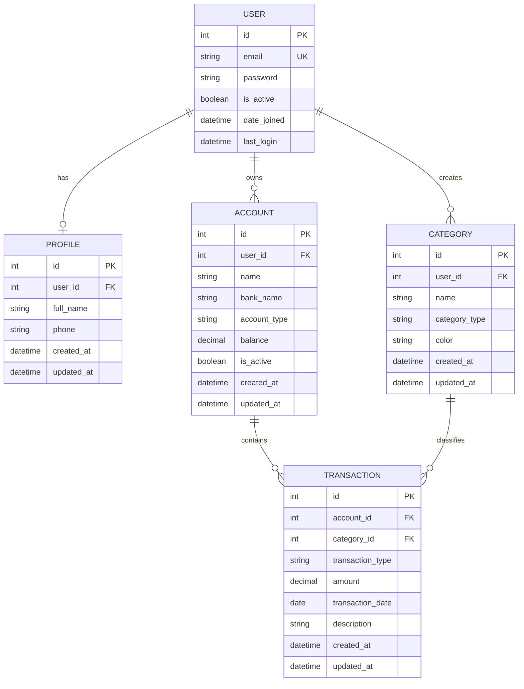

# Product Requirements Document (PRD) - Finanpy

## 1. Visão Geral

O Finanpy é um sistema de gestão de finanças pessoais desenvolvido com Python e Django, focado em simplicidade e eficiência. O projeto adota uma abordagem full-stack utilizando Django Template Language com TailwindCSS para o frontend, proporcionando uma experiência moderna e responsiva sem over-engineering.

## 2. Sobre o Produto

O Finanpy é uma aplicação web que permite aos usuários gerenciar suas finanças pessoais de forma intuitiva e organizada. O sistema oferece controle de contas bancárias, categorização de transações, visualização de entradas e saídas, e um dashboard centralizado para análise financeira. Com design moderno em tema escuro e gradientes harmônicos, o produto equilibra funcionalidade e estética.

## 3. Propósito

Fornecer uma ferramenta simples, eficiente e acessível para que pessoas possam organizar suas finanças pessoais, acompanhar receitas e despesas, categorizar transações e tomar decisões financeiras mais conscientes através de visualizações claras e objetivas.

## 4. Público Alvo

- **Perfil Primário**: Adultos entre 25-45 anos que buscam organizar suas finanças pessoais
- **Perfil Secundário**: Jovens profissionais iniciando sua independência financeira
- **Características Comuns**:
  - Possuem múltiplas contas bancárias
  - Necessitam controlar gastos mensais
  - Buscam simplicidade e praticidade
  - Têm acesso regular à internet
  - Preferem soluções diretas sem complexidade excessiva

## 5. Objetivos

### 5.1 Objetivos de Negócio
- Criar uma ferramenta MVP funcional de gestão financeira pessoal
- Estabelecer base de usuários engajados
- Demonstrar viabilidade técnica da solução

### 5.2 Objetivos de Produto
- Permitir cadastro e autenticação segura de usuários
- Possibilitar gerenciamento de múltiplas contas bancárias
- Facilitar registro e categorização de transações financeiras
- Fornecer visualização clara do panorama financeiro através de dashboard

### 5.3 Objetivos de Usuário
- Ter visão consolidada de todas as contas em um único lugar
- Categorizar e entender para onde o dinheiro está indo
- Controlar entradas e saídas de forma simples
- Acessar informações financeiras de forma rápida e intuitiva

## 6. Requisitos Funcionais

### 6.1 Autenticação e Usuários
- RF001: Sistema deve permitir cadastro de novos usuários com email e senha
- RF002: Sistema deve permitir login de usuários através do email
- RF003: Sistema deve permitir logout de usuários
- RF004: Sistema deve validar formato de email e força de senha
- RF005: Sistema deve impedir cadastro de emails duplicados

### 6.2 Gestão de Perfis
- RF006: Sistema deve criar perfil automaticamente ao cadastrar usuário
- RF007: Sistema deve permitir visualização de dados do perfil
- RF008: Sistema deve permitir edição de informações do perfil

### 6.3 Gestão de Contas Bancárias
- RF009: Sistema deve permitir cadastro de contas bancárias
- RF010: Sistema deve permitir listagem de todas as contas do usuário
- RF011: Sistema deve permitir edição de dados de contas
- RF012: Sistema deve permitir exclusão de contas
- RF013: Sistema deve exibir saldo atual de cada conta
- RF014: Sistema deve associar contas ao usuário logado

### 6.4 Gestão de Categorias
- RF015: Sistema deve permitir cadastro de categorias de transações
- RF016: Sistema deve permitir listagem de categorias do usuário
- RF017: Sistema deve permitir edição de categorias
- RF018: Sistema deve permitir exclusão de categorias
- RF019: Sistema deve diferenciar categorias de entrada e saída

### 6.5 Gestão de Transações
- RF020: Sistema deve permitir registro de transações de entrada
- RF021: Sistema deve permitir registro de transações de saída
- RF022: Sistema deve associar transação a uma conta bancária
- RF023: Sistema deve associar transação a uma categoria
- RF024: Sistema deve registrar data da transação
- RF025: Sistema deve permitir adicionar descrição à transação
- RF026: Sistema deve permitir listagem de transações do usuário
- RF027: Sistema deve permitir filtrar transações por período
- RF028: Sistema deve permitir filtrar transações por conta
- RF029: Sistema deve permitir filtrar transações por categoria
- RF030: Sistema deve permitir edição de transações
- RF031: Sistema deve permitir exclusão de transações

### 6.6 Dashboard
- RF032: Sistema deve exibir saldo total consolidado de todas as contas
- RF033: Sistema deve exibir total de entradas do período atual
- RF034: Sistema deve exibir total de saídas do período atual
- RF035: Sistema deve exibir balanço (entradas - saídas) do período
- RF036: Sistema deve exibir lista de transações recentes
- RF037: Sistema deve exibir resumo por categorias

### 6.7 Site Público
- RF038: Sistema deve ter página inicial pública de apresentação
- RF039: Página inicial deve ter botão de cadastro
- RF040: Página inicial deve ter botão de login
- RF041: Usuários não autenticados devem ser redirecionados ao site público
- RF042: Usuários autenticados devem ser redirecionados ao dashboard

### 6.2 Flowchart - Fluxos de UX

```mermaid
flowchart TD
    Start([Usuário acessa site]) --> CheckAuth{Usuário<br/>autenticado?}
    
    CheckAuth -->|Não| PublicHome[Página Inicial Pública]
    CheckAuth -->|Sim| Dashboard[Dashboard]
    
    PublicHome --> ActionChoice{Escolhe ação}
    ActionChoice -->|Cadastrar| RegisterForm[Formulário de Cadastro]
    ActionChoice -->|Login| LoginForm[Formulário de Login]
    
    RegisterForm --> ValidateReg{Dados<br/>válidos?}
    ValidateReg -->|Não| RegisterForm
    ValidateReg -->|Sim| CreateUser[Criar Usuário e Perfil]
    CreateUser --> AutoLogin[Login Automático]
    AutoLogin --> Dashboard
    
    LoginForm --> ValidateLogin{Credenciais<br/>válidas?}
    ValidateLogin -->|Não| LoginForm
    ValidateLogin -->|Sim| Dashboard
    
    Dashboard --> DashActions{Ação no Dashboard}
    
    DashActions -->|Gerenciar Contas| AccountsList[Lista de Contas]
    AccountsList --> AccActions{Ação}
    AccActions -->|Criar| CreateAccount[Criar Conta]
    AccActions -->|Editar| EditAccount[Editar Conta]
    AccActions -->|Excluir| DeleteAccount[Excluir Conta]
    AccActions -->|Voltar| Dashboard
    CreateAccount --> AccountsList
    EditAccount --> AccountsList
    DeleteAccount --> AccountsList
    
    DashActions -->|Gerenciar Categorias| CategoriesList[Lista de Categorias]
    CategoriesList --> CatActions{Ação}
    CatActions -->|Criar| CreateCategory[Criar Categoria]
    CatActions -->|Editar| EditCategory[Editar Categoria]
    CatActions -->|Excluir| DeleteCategory[Excluir Categoria]
    CatActions -->|Voltar| Dashboard
    CreateCategory --> CategoriesList
    EditCategory --> CategoriesList
    DeleteCategory --> CategoriesList
    
    DashActions -->|Gerenciar Transações| TransactionsList[Lista de Transações]
    TransactionsList --> TransActions{Ação}
    TransActions -->|Criar| CreateTransaction[Criar Transação]
    TransActions -->|Editar| EditTransaction[Editar Transação]
    TransActions -->|Excluir| DeleteTransaction[Excluir Transação]
    TransActions -->|Filtrar| FilterTransactions[Filtrar Transações]
    TransActions -->|Voltar| Dashboard
    CreateTransaction --> TransactionsList
    EditTransaction --> TransactionsList
    DeleteTransaction --> TransactionsList
    FilterTransactions --> TransactionsList
    
    DashActions -->|Ver Perfil| ProfileView[Visualizar Perfil]
    ProfileView --> ProfileActions{Ação}
    ProfileActions -->|Editar| EditProfile[Editar Perfil]
    ProfileActions -->|Voltar| Dashboard
    EditProfile --> ProfileView
    
    DashActions -->|Logout| Logout[Fazer Logout]
    Logout --> PublicHome
    
    style Dashboard fill:#2d5a3d
    style PublicHome fill:#1e3a5f
    style CreateUser fill:#4a5d23
    style AutoLogin fill:#4a5d23
```



## 7. Requisitos Não-Funcionais

### 7.1 Performance
- RNF001: Páginas devem carregar em menos de 2 segundos
- RNF002: Dashboard deve consolidar dados em tempo aceitável (<1s)
- RNF003: Sistema deve suportar pelo menos 100 usuários simultâneos

### 7.2 Segurança
- RNF004: Senhas devem ser armazenadas com hash seguro (Django padrão)
- RNF005: Sistema deve proteger rotas autenticadas
- RNF006: Dados de um usuário não devem ser acessíveis por outros
- RNF007: Sessões devem expirar após período de inatividade

### 7.3 Usabilidade
- RNF008: Interface deve ser responsiva para desktop, tablet e mobile
- RNF009: Design deve seguir padrões de acessibilidade básicos
- RNF010: Mensagens de erro devem ser claras e em português
- RNF011: Interface deve ter feedback visual para ações do usuário

### 7.4 Manutenibilidade
- RNF012: Código deve seguir PEP 8
- RNF013: Código deve usar aspas simples
- RNF014: Código deve ser escrito em inglês
- RNF015: Apps devem ter responsabilidades bem definidas
- RNF016: Models devem ter campos created_at e updated_at

### 7.5 Compatibilidade
- RNF017: Sistema deve funcionar nos principais navegadores (Chrome, Firefox, Safari, Edge)
- RNF018: Interface deve ser responsiva para resoluções a partir de 320px

### 7.6 Escalabilidade
- RNF019: Arquitetura deve permitir migração futura para PostgreSQL
- RNF020: Estrutura deve facilitar adição de novos módulos

## 8. Arquitetura Técnica

### 8.1 Stack Tecnológica

#### Backend
- **Linguagem**: Python 3.13+
- **Framework**: Django 5+
- **Banco de Dados**: SQLite3 (padrão Django)
- **Autenticação**: Django Auth (nativo)

#### Frontend
- **Template Engine**: Django Template Language
- **CSS Framework**: TailwindCSS
- **JavaScript**: Vanilla JS (mínimo necessário)

#### Infraestrutura
- **Servidor Web**: Django Development Server (desenvolvimento)
- **Ambiente Virtual**: venv
- **Gerenciador de Pacotes**: pip

### 8.2 Estrutura de Dados



### 8.3 Estrutura de Apps Django

```
finanpy/
├── core/           # Configurações globais e URLs principais
├── users/          # Extensão do User model do Django
├── profiles/       # Perfis de usuários
├── accounts/       # Contas bancárias
├── categories/     # Categorias de transações
├── transactions/   # Transações financeiras
└── static/         # Arquivos estáticos (CSS, JS, imagens)
```

## 9. Design System

### 9.1 Paleta de Cores

#### Cores Primárias
```css
/* Gradiente Principal */
primary-gradient: linear-gradient(135deg, #667eea 0%, #764ba2 100%)

/* Cores Sólidas */
primary-500: #667eea
primary-600: #5568d3
primary-700: #4453bd

accent-500: #764ba2
accent-600: #63418a
accent-700: #503672
```

#### Cores de Fundo
```css
/* Tema Escuro */
bg-primary: #0f172a      /* Fundo principal */
bg-secondary: #1e293b    /* Fundo de cards */
bg-tertiary: #334155     /* Fundo de hover */

/* Cores de Texto */
text-primary: #f1f5f9    /* Texto principal */
text-secondary: #cbd5e1  /* Texto secundário */
text-muted: #64748b      /* Texto menos importante */
```

#### Cores de Estado
```css
success: #10b981    /* Verde para entradas/sucesso */
error: #ef4444      /* Vermelho para saídas/erros */
warning: #f59e0b    /* Amarelo para avisos */
info: #3b82f6       /* Azul para informações */
```

### 9.2 Tipografia

```css
/* Fonte Principal */
font-family: 'Inter', system-ui, -apple-system, sans-serif

/* Tamanhos */
text-xs: 0.75rem      /* 12px */
text-sm: 0.875rem     /* 14px */
text-base: 1rem       /* 16px */
text-lg: 1.125rem     /* 18px */
text-xl: 1.25rem      /* 20px */
text-2xl: 1.5rem      /* 24px */
text-3xl: 1.875rem    /* 30px */
text-4xl: 2.25rem     /* 36px */

/* Pesos */
font-normal: 400
font-medium: 500
font-semibold: 600
font-bold: 700
```

### 9.3 Componentes

#### Botões

```html
<!-- Botão Primário -->
<button class="px-6 py-3 bg-gradient-to-r from-primary-500 to-accent-500 text-white rounded-lg font-medium hover:from-primary-600 hover:to-accent-600 transition-all duration-200 shadow-lg hover:shadow-xl">
    Texto do Botão
</button>

<!-- Botão Secundário -->
<button class="px-6 py-3 bg-bg-secondary text-text-primary rounded-lg font-medium hover:bg-bg-tertiary transition-all duration-200 border border-bg-tertiary">
    Texto do Botão
</button>

<!-- Botão de Sucesso -->
<button class="px-6 py-3 bg-success text-white rounded-lg font-medium hover:bg-green-600 transition-all duration-200">
    Salvar
</button>

<!-- Botão de Erro -->
<button class="px-6 py-3 bg-error text-white rounded-lg font-medium hover:bg-red-600 transition-all duration-200">
    Excluir
</button>

<!-- Botão Pequeno -->
<button class="px-4 py-2 text-sm bg-gradient-to-r from-primary-500 to-accent-500 text-white rounded-md font-medium hover:from-primary-600 hover:to-accent-600 transition-all duration-200">
    Ação
</button>
```

#### Inputs e Forms

```html
<!-- Input Padrão -->
<div class="mb-4">
    <label class="block text-text-secondary text-sm font-medium mb-2">
        Label do Campo
    </label>
    <input type="text" class="w-full px-4 py-3 bg-bg-secondary border border-bg-tertiary rounded-lg text-text-primary focus:outline-none focus:ring-2 focus:ring-primary-500 focus:border-transparent transition-all duration-200" placeholder="Digite aqui...">
</div>

<!-- Select -->
<div class="mb-4">
    <label class="block text-text-secondary text-sm font-medium mb-2">
        Selecione uma opção
    </label>
    <select class="w-full px-4 py-3 bg-bg-secondary border border-bg-tertiary rounded-lg text-text-primary focus:outline-none focus:ring-2 focus:ring-primary-500 focus:border-transparent transition-all duration-200">
        <option>Opção 1</option>
        <option>Opção 2</option>
    </select>
</div>

<!-- Textarea -->
<div class="mb-4">
    <label class="block text-text-secondary text-sm font-medium mb-2">
        Descrição
    </label>
    <textarea rows="4" class="w-full px-4 py-3 bg-bg-secondary border border-bg-tertiary rounded-lg text-text-primary focus:outline-none focus:ring-2 focus:ring-primary-500 focus:border-transparent transition-all duration-200" placeholder="Digite aqui..."></textarea>
</div>
```

#### Cards

```html
<!-- Card Padrão -->
<div class="bg-bg-secondary rounded-xl p-6 shadow-lg border border-bg-tertiary">
    <h3 class="text-xl font-semibold text-text-primary mb-4">Título do Card</h3>
    <p class="text-text-secondary">Conteúdo do card aqui...</p>
</div>

<!-- Card com Gradiente -->
<div class="bg-gradient-to-br from-primary-500 to-accent-500 rounded-xl p-6 shadow-xl">
    <h3 class="text-xl font-semibold text-white mb-2">Saldo Total</h3>
    <p class="text-3xl font-bold text-white">R$ 10.500,00</p>
</div>

<!-- Card de Estatística -->
<div class="bg-bg-secondary rounded-xl p-6 shadow-lg border border-bg-tertiary hover:border-primary-500 transition-all duration-200">
    <div class="flex items-center justify-between mb-2">
        <span class="text-text-secondary text-sm font-medium">Entradas</span>
        <span class="text-success text-sm">↑</span>
    </div>
    <p class="text-2xl font-bold text-text-primary">R$ 5.200,00</p>
    <p class="text-text-muted text-xs mt-1">+12% vs mês anterior</p>
</div>
```

#### Tabelas

```html
<div class="bg-bg-secondary rounded-xl shadow-lg border border-bg-tertiary overflow-hidden">
    <table class="w-full">
        <thead>
            <tr class="bg-bg-tertiary">
                <th class="px-6 py-4 text-left text-text-secondary text-sm font-semibold">Coluna 1</th>
                <th class="px-6 py-4 text-left text-text-secondary text-sm font-semibold">Coluna 2</th>
                <th class="px-6 py-4 text-left text-text-secondary text-sm font-semibold">Ações</th>
            </tr>
        </thead>
        <tbody>
            <tr class="border-t border-bg-tertiary hover:bg-bg-tertiary transition-all duration-150">
                <td class="px-6 py-4 text-text-primary">Dado 1</td>
                <td class="px-6 py-4 text-text-primary">Dado 2</td>
                <td class="px-6 py-4">
                    <button class="text-primary-500 hover:text-primary-400 text-sm font-medium">Editar</button>
                </td>
            </tr>
        </tbody>
    </table>
</div>
```

#### Menu de Navegação

```html
<!-- Navbar -->
<nav class="bg-bg-secondary border-b border-bg-tertiary shadow-lg">
    <div class="max-w-7xl mx-auto px-4 sm:px-6 lg:px-8">
        <div class="flex items-center justify-between h-16">
            <div class="flex items-center">
                <span class="text-2xl font-bold bg-gradient-to-r from-primary-500 to-accent-500 bg-clip-text text-transparent">
                    Finanpy
                </span>
            </div>
            <div class="flex items-center space-x-4">
                <a href="#" class="text-text-secondary hover:text-text-primary transition-colors duration-200">Dashboard</a>
                <a href="#" class="text-text-secondary hover:text-text-primary transition-colors duration-200">Contas</a>
                <a href="#" class="text-text-secondary hover:text-text-primary transition-colors duration-200">Transações</a>
                <button class="px-4 py-2 bg-error text-white rounded-lg text-sm font-medium hover:bg-red-600 transition-all duration-200">
                    Sair
                </button>
            </div>
        </div>
    </div>
</nav>

<!-- Sidebar (opcional) -->
<aside class="w-64 bg-bg-secondary h-screen fixed left-0 top-0 border-r border-bg-tertiary p-6">
    <div class="mb-8">
        <span class="text-2xl font-bold bg-gradient-to-r from-primary-500 to-accent-500 bg-clip-text text-transparent">
            Finanpy
        </span>
    </div>
    <nav class="space-y-2">
        <a href="#" class="flex items-center px-4 py-3 text-text-primary bg-bg-tertiary rounded-lg font-medium">
            Dashboard
        </a>
        <a href="#" class="flex items-center px-4 py-3 text-text-secondary hover:text-text-primary hover:bg-bg-tertiary rounded-lg transition-all duration-200">
            Contas
        </a>
        <a href="#" class="flex items-center px-4 py-3 text-text-secondary hover:text-text-primary hover:bg-bg-tertiary rounded-lg transition-all duration-200">
            Categorias
        </a>
        <a href="#" class="flex items-center px-4 py-3 text-text-secondary hover:text-text-primary hover:bg-bg-tertiary rounded-lg transition-all duration-200">
            Transações
        </a>
    </nav>
</aside>
```

#### Alertas e Mensagens

```html
<!-- Sucesso -->
<div class="bg-success/10 border border-success/20 rounded-lg p-4 mb-4">
    <p class="text-success font-medium">Operação realizada com sucesso!</p>
</div>

<!-- Erro -->
<div class="bg-error/10 border border-error/20 rounded-lg p-4 mb-4">
    <p class="text-error font-medium">Ocorreu um erro. Tente novamente.</p>
</div>

<!-- Aviso -->
<div class="bg-warning/10 border border-warning/20 rounded-lg p-4 mb-4">
    <p class="text-warning font-medium">Atenção: verifique os dados informados.</p>
</div>

<!-- Informação -->
<div class="bg-info/10 border border-info/20 rounded-lg p-4 mb-4">
    <p class="text-info font-medium">Informação importante sobre o sistema.</p>
</div>
```

### 9.4 Grid e Layout

```html
<!-- Container Principal -->
<div class="max-w-7xl mx-auto px-4 sm:px-6 lg:px-8 py-8">
    <!-- Conteúdo -->
</div>

<!-- Grid 2 Colunas -->
<div class="grid grid-cols-1 md:grid-cols-2 gap-6">
    <div>Coluna 1</div>
    <div>Coluna 2</div>
</div>

<!-- Grid 3 Colunas -->
<div class="grid grid-cols-1 md:grid-cols-2 lg:grid-cols-3 gap-6">
    <div>Coluna 1</div>
    <div>Coluna 2</div>
    <div>Coluna 3</div>
</div>

<!-- Grid 4 Colunas -->
<div class="grid grid-cols-1 sm:grid-cols-2 lg:grid-cols-4 gap-6">
    <div>Coluna 1</div>
    <div>Coluna 2</div>
    <div>Coluna 3</div>
    <div>Coluna 4</div>
</div>
```

### 9.5 Espaçamentos Padrão

```css
/* Padding e Margin */
spacing-1: 0.25rem   /* 4px */
spacing-2: 0.5rem    /* 8px */
spacing-3: 0.75rem   /* 12px */
spacing-4: 1rem      /* 16px */
spacing-6: 1.5rem    /* 24px */
spacing-8: 2rem      /* 32px */
spacing-12: 3rem     /* 48px */
spacing-16: 4rem     /* 64px */

/* Bordas Arredondadas */
rounded-md: 0.375rem   /* 6px */
rounded-lg: 0.5rem     /* 8px */
rounded-xl: 0.75rem    /* 12px */
rounded-2xl: 1rem      /* 16px */
```

## 10. User Stories

### Épico 1: Autenticação e Cadastro

#### US1.1: Cadastro de Novo Usuário
**Como** visitante  
**Quero** criar uma conta no sistema  
**Para** começar a gerenciar minhas finanças pessoais

**Critérios de Aceite:**
- [ ] Formulário de cadastro deve solicitar email e senha
- [ ] Email deve ser validado quanto ao formato
- [ ] Senha deve ter no mínimo 8 caracteres
- [ ] Sistema deve impedir cadastro com email já existente
- [ ] Perfil deve ser criado automaticamente após cadastro
- [ ] Usuário deve ser redirecionado ao dashboard após cadastro
- [ ] Mensagem de sucesso deve ser exibida

#### US1.2: Login de Usuário
**Como** usuário cadastrado  
**Quero** fazer login no sistema com meu email  
**Para** acessar minhas informações financeiras

**Critérios de Aceite:**
- [ ] Formulário deve aceitar email e senha
- [ ] Sistema deve validar credenciais
- [ ] Mensagem de erro clara deve ser exibida para credenciais inválidas
- [ ] Usuário deve ser redirecionado ao dashboard após login bem-sucedido
- [ ] Sessão deve ser mantida até logout ou timeout

#### US1.3: Logout de Usuário
**Como** usuário logado  
**Quero** sair do sistema  
**Para** proteger minhas informações

**Critérios de Aceite:**
- [ ] Botão de logout deve estar visível em todas as páginas
- [ ] Sessão deve ser encerrada ao clicar em logout
- [ ] Usuário deve ser redirecionado à página inicial pública
- [ ] Confirmação de logout não é necessária

### Épico 2: Gestão de Perfil

#### US2.1: Visualização de Perfil
**Como** usuário logado  
**Quero** visualizar os dados do meu perfil  
**Para** confirmar minhas informações cadastradas

**Critérios de Aceite:**
- [ ] Página deve exibir nome completo
- [ ] Página deve exibir telefone
- [ ] Página deve exibir email (não editável)
- [ ] Página deve ter botão para editar perfil

#### US2.2: Edição de Perfil
**Como** usuário logado  
**Quero** editar os dados do meu perfil  
**Para** manter minhas informações atualizadas

**Critérios de Aceite:**
- [ ] Formulário deve permitir edição de nome completo
- [ ] Formulário deve permitir edição de telefone
- [ ] Validações devem ser aplicadas aos campos
- [ ] Mensagem de sucesso deve ser exibida após salvar
- [ ] Dados devem ser atualizados no banco de dados

### Épico 3: Gestão de Contas Bancárias

#### US3.1: Cadastro de Conta Bancária
**Como** usuário logado  
**Quero** cadastrar uma nova conta bancária  
**Para** registrar transações nesta conta

**Critérios de Aceite:**
- [ ] Formulário deve solicitar nome da conta
- [ ] Formulário deve solicitar nome do banco
- [ ] Formulário deve solicitar tipo de conta (corrente, poupança, carteira)
- [ ] Formulário deve solicitar saldo inicial
- [ ] Conta deve ser associada ao usuário logado
- [ ] Conta deve ser criada como ativa por padrão
- [ ] Mensagem de sucesso deve ser exibida

#### US3.2: Listagem de Contas
**Como** usuário logado  
**Quero** ver todas as minhas contas cadastradas  
**Para** ter visão geral das minhas contas

**Critérios de Aceite:**
- [ ] Lista deve exibir nome da conta
- [ ] Lista deve exibir nome do banco
- [ ] Lista deve exibir tipo de conta
- [ ] Lista deve exibir saldo atual
- [ ] Lista deve exibir apenas contas do usuário logado
- [ ] Deve haver botão para cadastrar nova conta
- [ ] Cada item deve ter opções de editar e excluir

#### US3.3: Edição de Conta
**Como** usuário logado  
**Quero** editar dados de uma conta  
**Para** corrigir ou atualizar informações

**Critérios de Aceite:**
- [ ] Formulário deve vir preenchido com dados atuais
- [ ] Todos os campos devem ser editáveis
- [ ] Validações devem ser aplicadas
- [ ] Mensagem de sucesso deve ser exibida após salvar

#### US3.4: Exclusão de Conta
**Como** usuário logado  
**Quero** excluir uma conta  
**Para** remover contas que não uso mais

**Critérios de Aceite:**
- [ ] Sistema deve solicitar confirmação antes de excluir
- [ ] Conta deve ser excluída permanentemente (ou desativada)
- [ ] Mensagem de sucesso deve ser exibida
- [ ] Transações da conta devem ser tratadas (manter registro histórico)

### Épico 4: Gestão de Categorias

#### US4.1: Cadastro de Categoria
**Como** usuário logado  
**Quero** criar categorias personalizadas  
**Para** organizar minhas transações

**Critérios de Aceite:**
- [ ] Formulário deve solicitar nome da categoria
- [ ] Formulário deve solicitar tipo (entrada ou saída)
- [ ] Formulário deve permitir escolher cor
- [ ] Categoria deve ser associada ao usuário
- [ ] Mensagem de sucesso deve ser exibida

#### US4.2: Listagem de Categorias
**Como** usuário logado  
**Quero** ver todas as minhas categorias  
**Para** gerenciar como organizo minhas transações

**Critérios de Aceite:**
- [ ] Lista deve exibir nome da categoria
- [ ] Lista deve indicar se é entrada ou saída
- [ ] Lista deve mostrar cor associada
- [ ] Lista deve exibir apenas categorias do usuário
- [ ] Deve haver botão para criar nova categoria
- [ ] Cada item deve ter opções de editar e excluir

#### US4.3: Edição de Categoria
**Como** usuário logado  
**Quero** editar uma categoria  
**Para** ajustar nome, tipo ou cor

**Critérios de Aceite:**
- [ ] Formulário deve vir preenchido
- [ ] Todos os campos devem ser editáveis
- [ ] Mensagem de sucesso deve ser exibida

#### US4.4: Exclusão de Categoria
**Como** usuário logado  
**Quero** excluir categorias não utilizadas  
**Para** manter apenas categorias relevantes

**Critérios de Aceite:**
- [ ] Sistema deve solicitar confirmação
- [ ] Categoria deve ser excluída
- [ ] Transações com esta categoria devem ser tratadas
- [ ] Mensagem de sucesso deve ser exibida

### Épico 5: Gestão de Transações

#### US5.1: Registro de Transação de Entrada
**Como** usuário logado  
**Quero** registrar uma entrada de dinheiro  
**Para** controlar minhas receitas

**Critérios de Aceite:**
- [ ] Formulário deve solicitar conta
- [ ] Formulário deve solicitar categoria
- [ ] Formulário deve solicitar valor
- [ ] Formulário deve solicitar data
- [ ] Formulário deve solicitar descrição (opcional)
- [ ] Tipo deve ser definido como "entrada"
- [ ] Saldo da conta deve ser atualizado
- [ ] Mensagem de sucesso deve ser exibida

#### US5.2: Registro de Transação de Saída
**Como** usuário logado  
**Quero** registrar uma saída de dinheiro  
**Para** controlar minhas despesas

**Critérios de Aceite:**
- [ ] Formulário deve solicitar conta
- [ ] Formulário deve solicitar categoria
- [ ] Formulário deve solicitar valor
- [ ] Formulário deve solicitar data
- [ ] Formulário deve solicitar descrição (opcional)
- [ ] Tipo deve ser definido como "saída"
- [ ] Saldo da conta deve ser atualizado
- [ ] Mensagem de sucesso deve ser exibida

#### US5.3: Listagem de Transações
**Como** usuário logado  
**Quero** ver todas as minhas transações  
**Para** acompanhar meu histórico financeiro

**Critérios de Aceite:**
- [ ] Lista deve exibir data da transação
- [ ] Lista deve exibir descrição
- [ ] Lista deve exibir conta
- [ ] Lista deve exibir categoria
- [ ] Lista deve exibir valor
- [ ] Lista deve indicar se é entrada ou saída (cores diferentes)
- [ ] Lista deve ser ordenada por data (mais recente primeiro)
- [ ] Deve haver botão para registrar nova transação
- [ ] Cada item deve ter opções de editar e excluir

#### US5.4: Filtragem de Transações
**Como** usuário logado  
**Quero** filtrar transações por período, conta ou categoria  
**Para** analisar movimentações específicas

**Critérios de Aceite:**
- [ ] Deve haver filtro por período (data inicial e final)
- [ ] Deve haver filtro por conta
- [ ] Deve haver filtro por categoria
- [ ] Filtros devem poder ser combinados
- [ ] Deve haver botão para limpar filtros
- [ ] Resultados devem atualizar ao aplicar filtros

#### US5.5: Edição de Transação
**Como** usuário logado  
**Quero** editar uma transação  
**Para** corrigir informações registradas incorretamente

**Critérios de Aceite:**
- [ ] Formulário deve vir preenchido
- [ ] Todos os campos devem ser editáveis
- [ ] Saldo das contas deve ser recalculado
- [ ] Mensagem de sucesso deve ser exibida

#### US5.6: Exclusão de Transação
**Como** usuário logado  
**Quero** excluir uma transação  
**Para** remover lançamentos duplicados ou incorretos

**Critérios de Aceite:**
- [ ] Sistema deve solicitar confirmação
- [ ] Transação deve ser excluída
- [ ] Saldo da conta deve ser recalculado
- [ ] Mensagem de sucesso deve ser exibida

### Épico 6: Dashboard e Visualização

#### US6.1: Visualização do Dashboard
**Como** usuário logado  
**Quero** ver um resumo das minhas finanças  
**Para** ter visão geral da minha situação financeira

**Critérios de Aceite:**
- [ ] Dashboard deve exibir saldo total consolidado
- [ ] Dashboard deve exibir total de entradas do mês
- [ ] Dashboard deve exibir total de saídas do mês
- [ ] Dashboard deve exibir balanço do mês (entradas - saídas)
- [ ] Dashboard deve exibir lista das últimas transações
- [ ] Dashboard deve exibir resumo por categorias
- [ ] Valores devem ser formatados em reais (R$)
- [ ] Entradas devem ter cor verde
- [ ] Saídas devem ter cor vermelha

#### US6.2: Acesso Rápido a Funcionalidades
**Como** usuário logado  
**Quero** acessar rapidamente as principais funcionalidades  
**Para** navegar eficientemente pelo sistema

**Critérios de Aceite:**
- [ ] Dashboard deve ter botões de acesso rápido
- [ ] Deve haver botão para nova transação
- [ ] Deve haver botão para nova conta
- [ ] Deve haver botão para nova categoria
- [ ] Menu de navegação deve estar sempre visível

### Épico 7: Site Público

#### US7.1: Página Inicial Pública
**Como** visitante  
**Quero** ver informações sobre o sistema  
**Para** decidir se quero me cadastrar

**Critérios de Aceite:**
- [ ] Página deve apresentar o Finanpy
- [ ] Página deve listar principais funcionalidades
- [ ] Página deve ter design atrativo e moderno
- [ ] Deve haver botão de cadastro destacado
- [ ] Deve haver botão de login
- [ ] Usuários autenticados devem ser redirecionados ao dashboard

## 11. Métricas de Sucesso

### 11.1 KPIs de Produto

#### Adoção e Uso
- **Taxa de Conversão de Cadastro**: % de visitantes que completam cadastro
  - Meta: > 15%
- **Usuários Ativos Diários (DAU)**: Usuários que acessam o sistema por dia
  - Meta: > 60% dos usuários cadastrados
- **Usuários Ativos Mensais (MAU)**: Usuários que acessam o sistema por mês
  - Meta: > 80% dos usuários cadastrados
- **Taxa de Retenção**: % de usuários que retornam após primeiro acesso
  - Meta: > 70% em 30 dias

#### Engajamento
- **Média de Transações por Usuário**: Número de transações registradas por usuário
  - Meta: > 15 transações/mês
- **Tempo Médio de Sessão**: Tempo que usuário passa no sistema
  - Meta: > 5 minutos
- **Frequência de Acesso**: Quantas vezes o usuário acessa por semana
  - Meta: > 3 acessos/semana

#### Performance
- **Tempo de Carregamento de Páginas**: Tempo para página carregar completamente
  - Meta: < 2 segundos
- **Taxa de Erro**: % de requisições que resultam em erro
  - Meta: < 1%
- **Disponibilidade do Sistema**: % de tempo que sistema está disponível
  - Meta: > 99%

### 11.2 KPIs de Usuário

#### Satisfação
- **Net Promoter Score (NPS)**: Probabilidade de recomendar o sistema
  - Meta: > 50
- **Taxa de Abandono**: % de usuários que param de usar o sistema
  - Meta: < 20% ao mês
- **Feedback Positivo**: % de avaliações positivas
  - Meta: > 80%

#### Comportamento
- **Contas por Usuário**: Número médio de contas cadastradas
  - Meta: > 2 contas
- **Categorias por Usuário**: Número médio de categorias criadas
  - Meta: > 5 categorias
- **Completude de Perfil**: % de usuários com perfil completo
  - Meta: > 90%

### 11.3 KPIs de Negócio

#### Crescimento
- **Taxa de Crescimento de Usuários**: % de aumento de usuários por mês
  - Meta: > 20% ao mês
- **Custo de Aquisição de Cliente (CAC)**: Custo para adquirir novo usuário
  - Meta: Minimizar (MVP sem custos de marketing)
- **Lifetime Value (LTV)**: Valor gerado por usuário ao longo do tempo
  - Meta: A definir em versões futuras monetizadas

#### Operacional
- **Tempo de Resolução de Bugs**: Tempo médio para corrigir problemas
  - Meta: < 48 horas para bugs críticos
- **Taxa de Sucesso de Deploy**: % de deploys sem rollback
  - Meta: > 95%

## 12. Riscos e Mitigações

### 12.1 Riscos Técnicos

#### RT1: Problemas de Performance com SQLite
**Probabilidade**: Média  
**Impacto**: Alto  
**Descrição**: SQLite pode ter limitações de performance com múltiplos usuários simultâneos ou grande volume de transações.

**Mitigação**:
- Implementar índices adequados nas tabelas
- Monitorar performance desde o início
- Planejar migração para PostgreSQL em versões futuras
- Limitar número de usuários na fase MVP
- Implementar cache quando necessário

#### RT2: Segurança de Dados Financeiros
**Probabilidade**: Baixa  
**Impacto**: Crítico  
**Descrição**: Vazamento ou acesso não autorizado a dados financeiros sensíveis.

**Mitigação**:
- Usar sistema de autenticação nativo do Django (testado e seguro)
- Implementar validações de permissão em todas as views
- Usar HTTPS em produção
- Implementar rate limiting para prevenir ataques
- Realizar code review focado em segurança
- Sanitizar inputs do usuário

#### RT3: Inconsistência de Saldos
**Probabilidade**: Média  
**Impacto**: Alto  
**Descrição**: Erros no cálculo de saldos ao criar, editar ou excluir transações.

**Mitigação**:
- Implementar lógica de atualização de saldo em signals
- Criar métodos centralizados para cálculo de saldos
- Implementar testes unitários para operações financeiras (sprint final)
- Adicionar validações de integridade
- Implementar sistema de auditoria de transações

#### RT4: Experiência Ruim em Mobile
**Probabilidade**: Média  
**Impacto**: Médio  
**Descrição**: Interface pode não funcionar bem em dispositivos móveis menores.

**Mitigação**:
- Usar TailwindCSS com classes responsivas desde o início
- Testar em múltiplos tamanhos de tela durante desenvolvimento
- Priorizar mobile-first design
- Implementar gestures e interações touch-friendly

### 12.2 Riscos de Produto

#### RP1: Baixa Adoção de Usuários
**Probabilidade**: Média  
**Impacto**: Alto  
**Descrição**: Usuários podem não ver valor suficiente no MVP.

**Mitigação**:
- Focar em funcionalidades essenciais bem executadas
- Coletar feedback de usuários beta
- Iterar rapidamente baseado em feedback
- Simplificar ao máximo o processo de cadastro e primeiro uso
- Criar tutoriais e documentação clara

#### RP2: Complexidade de Uso
**Probabilidade**: Baixa  
**Impacto**: Médio  
**Descrição**: Sistema pode ser percebido como complicado para usuários não técnicos.

**Mitigação**:
- Manter interface simples e intuitiva
- Usar linguagem clara em português
- Implementar tooltips e mensagens de ajuda
- Realizar testes de usabilidade
- Fornecer exemplos e valores default quando possível

#### RP3: Concorrência
**Probabilidade**: Alta  
**Impacto**: Médio  
**Descrição**: Existem muitas soluções similares no mercado.

**Mitigação**:
- Focar em simplicidade como diferencial
- Implementar funcionalidades únicas em versões futuras
- Manter design moderno e atrativo
- Oferecer gratuitamente no MVP para ganhar tração
- Coletar feedback para identificar necessidades não atendidas

### 12.3 Riscos de Cronograma

#### RC1: Subestimação de Tempo
**Probabilidade**: Alta  
**Impacto**: Médio  
**Descrição**: Tarefas podem levar mais tempo que o estimado.

**Mitigação**:
- Quebrar tarefas em subtarefas menores e específicas
- Adicionar buffer de tempo em cada sprint
- Priorizar funcionalidades críticas
- Remover funcionalidades nice-to-have se necessário
- Revisão semanal do progresso

#### RC2: Bloqueios Técnicos
**Probabilidade**: Média  
**Impacto**: Médio  
**Descrição**: Problemas técnicos inesperados podem bloquear desenvolvimento.

**Mitigação**:
- Pesquisar soluções antes de implementar
- Manter documentação de decisões técnicas
- Ter planos alternativos para implementações críticas
- Buscar ajuda da comunidade Django quando necessário

### 12.4 Riscos de Manutenibilidade

#### RM1: Código Difícil de Manter
**Probabilidade**: Baixa  
**Impacto**: Alto  
**Descrição**: Código mal estruturado pode dificultar manutenção futura.

**Mitigação**:
- Seguir PEP 8 rigorosamente
- Manter apps com responsabilidades bem definidas
- Documentar decisões arquiteturais importantes
- Realizar code review periódico
- Refatorar quando necessário
- Usar convenções do Django

#### RM2: Falta de Testes
**Probabilidade**: Alta  
**Impacto**: Médio  
**Descrição**: Ausência de testes pode causar regressões.

**Mitigação**:
- Planejar implementação de testes em sprint final
- Documentar casos de uso críticos para futuros testes
- Testar manualmente funcionalidades críticas
- Priorizar testes de operações financeiras quando implementar

## 13. Lista de Tarefas

### Sprint 0: Configuração Inicial do Projeto (Setup)

#### Tarefa 0.1: Configuração do Ambiente de Desenvolvimento
**Descrição**: Preparar ambiente local para desenvolvimento do projeto

**Subtarefas**:
- [X] 0.1.1: Criar diretório do projeto `finanpy`
- [X] 0.1.2: Criar ambiente virtual Python: `python -m venv venv`
- [X] 0.1.3: Ativar ambiente virtual
- [X] 0.1.4: Criar arquivo `requirements.txt` com dependências iniciais:
  ```
  Django==4.2.7
  python-decouple==3.8
  ```
- [X] 0.1.5: Instalar dependências: `pip install -r requirements.txt`
- [X] 0.1.6: Criar arquivo `.gitignore` com conteúdo padrão para Django:
  ```
  venv/
  __pycache__/
  *.pyc
  db.sqlite3
  .env
  *.log
  media/
  staticfiles/
  ```

#### Tarefa 0.2: Criação do Projeto Django
**Descrição**: Inicializar projeto Django e configurar estrutura base

**Subtarefas**:
- [X] 0.2.1: Criar projeto Django: `django-admin startproject core .`
- [X] 0.2.2: Renomear diretório do projeto de `core` para `core` se necessário
- [X] 0.2.3: Testar servidor de desenvolvimento: `python manage.py runserver`
- [X] 0.2.4: Verificar acesso em `http://localhost:8000`

#### Tarefa 0.3: Configuração de Settings
**Descrição**: Configurar arquivo settings.py com boas práticas

**Subtarefas**:
- [ ] 0.3.1: Criar arquivo `.env` na raiz do projeto
- [ ] 0.3.2: Mover SECRET_KEY para arquivo `.env`
- [ ] 0.3.3: Configurar DEBUG através de variável de ambiente
- [ ] 0.3.4: Configurar ALLOWED_HOSTS
- [ ] 0.3.5: Adicionar configuração para usar aspas simples no código
- [ ] 0.3.6: Configurar LANGUAGE_CODE = 'pt-br'
- [ ] 0.3.7: Configurar TIME_ZONE = 'America/Sao_Paulo'
- [ ] 0.3.8: Configurar USE_I18N = True
- [ ] 0.3.9: Configurar USE_TZ = True

#### Tarefa 0.4: Criação de Apps Django
**Descrição**: Criar todos os apps necessários do projeto

**Subtarefas**:
- [X] 0.4.1: Criar app `users`: `python manage.py startapp users`
- [X] 0.4.2: Criar app `profiles`: `python manage.py startapp profiles`
- [X] 0.4.3: Criar app `accounts`: `python manage.py startapp accounts`
- [X] 0.4.4: Criar app `categories`: `python manage.py startapp categories`
- [X] 0.4.5: Criar app `transactions`: `python manage.py startapp transactions`
- [X] 0.4.6: Adicionar todos os apps em INSTALLED_APPS no settings.py:
  ```python
  INSTALLED_APPS = [
      'django.contrib.admin',
      'django.contrib.auth',
      'django.contrib.contenttypes',
      'django.contrib.sessions',
      'django.contrib.messages',
      'django.contrib.staticfiles',
      'users',
      'profiles',
      'accounts',
      'categories',
      'transactions',
  ]
  ```

#### Tarefa 0.5: Configuração de TailwindCSS
**Descrição**: Integrar TailwindCSS ao projeto Django

**Subtarefas**:
- [ ] 0.5.1: Instalar django-tailwind: adicionar `django-tailwind==3.8.0` ao requirements.txt
- [ ] 0.5.2: Instalar dependência: `pip install django-tailwind`
- [ ] 0.5.3: Adicionar 'tailwind' ao INSTALLED_APPS
- [ ] 0.5.4: Executar: `python manage.py tailwind init`
- [ ] 0.5.5: Adicionar app theme gerado ao INSTALLED_APPS
- [ ] 0.5.6: Configurar TAILWIND_APP_NAME no settings.py
- [ ] 0.5.7: Instalar dependências do Tailwind: `python manage.py tailwind install`
- [ ] 0.5.8: Configurar NPM_BIN_PATH no settings.py se necessário

#### Tarefa 0.6: Estrutura de Templates e Static
**Descrição**: Criar estrutura de diretórios para templates e arquivos estáticos

**Subtarefas**:
- [ ] 0.6.1: Criar diretório `templates` na raiz do projeto
- [ ] 0.6.2: Criar diretório `static` na raiz do projeto
- [ ] 0.6.3: Configurar TEMPLATES no settings.py para incluir diretório templates:
  ```python
  'DIRS': [BASE_DIR / 'templates'],
  ```
- [ ] 0.6.4: Configurar STATIC_URL e STATICFILES_DIRS no settings.py:
  ```python
  STATIC_URL = '/static/'
  STATICFILES_DIRS = [BASE_DIR / 'static']
  ```
- [ ] 0.6.5: Criar subdiretórios em templates: `templates/base/`, `templates/auth/`, etc.

#### Tarefa 0.7: Configuração Inicial do Git
**Descrição**: Inicializar repositório Git e fazer commit inicial

**Subtarefas**:
- [ ] 0.7.1: Inicializar repositório Git: `git init`
- [ ] 0.7.2: Verificar que .gitignore está configurado corretamente
- [ ] 0.7.3: Adicionar arquivos: `git add .`
- [ ] 0.7.4: Fazer commit inicial: `git commit -m "Initial project setup"`
- [ ] 0.7.5: Criar arquivo README.md com informações básicas do projeto

---

### Sprint 1: Autenticação e Sistema de Usuários

#### Tarefa 1.1: Model de Usuário Customizado
**Descrição**: Criar model customizado que herda de User do Django para permitir login com email

**Subtarefas**:
- [ ] 1.1.1: Abrir arquivo `users/models.py`
- [ ] 1.1.2: Importar AbstractUser e models do Django
- [ ] 1.1.3: Criar classe CustomUser herdando de AbstractUser
- [ ] 1.1.4: Definir campo email como único: `email = models.EmailField(unique=True)`
- [ ] 1.1.5: Definir USERNAME_FIELD = 'email'
- [ ] 1.1.6: Definir REQUIRED_FIELDS = []
- [ ] 1.1.7: Adicionar campos created_at e updated_at
- [ ] 1.1.8: Adicionar método __str__ retornando email
- [ ] 1.1.9: Configurar AUTH_USER_MODEL = 'users.CustomUser' no settings.py

#### Tarefa 1.2: Configuração do Admin para CustomUser
**Descrição**: Configurar Django Admin para gerenciar usuários customizados

**Subtarefas**:
- [ ] 1.2.1: Abrir arquivo `users/admin.py`
- [ ] 1.2.2: Importar UserAdmin do Django
- [ ] 1.2.3: Importar CustomUser model
- [ ] 1.2.4: Criar classe CustomUserAdmin herdando de UserAdmin
- [ ] 1.2.5: Configurar list_display com email, is_staff, is_active, date_joined
- [ ] 1.2.6: Configurar ordering = ['email']
- [ ] 1.2.7: Registrar CustomUser com CustomUserAdmin

#### Tarefa 1.3: Model de Profile
**Descrição**: Criar model de perfil de usuário com informações adicionais

**Subtarefas**:
- [ ] 1.3.1: Abrir arquivo `profiles/models.py`
- [ ] 1.3.2: Importar models e User (get_user_model)
- [ ] 1.3.3: Criar classe Profile com campo OneToOneField para User
- [ ] 1.3.4: Adicionar campo full_name (CharField, max_length=200, blank=True)
- [ ] 1.3.5: Adicionar campo phone (CharField, max_length=20, blank=True)
- [ ] 1.3.6: Adicionar campos created_at e updated_at
- [ ] 1.3.7: Adicionar método __str__ retornando full_name ou email do usuário
- [ ] 1.3.8: Adicionar Meta com verbose_name e verbose_name_plural

#### Tarefa 1.4: Signal para Criação Automática de Profile
**Descrição**: Implementar signal para criar perfil automaticamente ao criar usuário

**Subtarefas**:
- [ ] 1.4.1: Criar arquivo `profiles/signals.py`
- [ ] 1.4.2: Importar post_save signal e receiver decorator
- [ ] 1.4.3: Importar User model (get_user_model)
- [ ] 1.4.4: Importar Profile model
- [ ] 1.4.5: Criar função create_profile com decorator @receiver(post_save, sender=User)
- [ ] 1.4.6: Verificar if created e criar Profile.objects.create(user=instance)
- [ ] 1.4.7: Abrir arquivo `profiles/apps.py`
- [ ] 1.4.8: Override método ready() para importar signals
- [ ] 1.4.9: Adicionar import de signals no método ready

#### Tarefa 1.5: Configuração do Admin para Profile
**Descrição**: Configurar Django Admin para gerenciar perfis

**Subtarefas**:
- [ ] 1.5.1: Abrir arquivo `profiles/admin.py`
- [ ] 1.5.2: Importar admin e Profile model
- [ ] 1.5.3: Criar classe ProfileAdmin
- [ ] 1.5.4: Configurar list_display com user email, full_name, phone
- [ ] 1.5.5: Configurar search_fields com user email e full_name
- [ ] 1.5.6: Registrar Profile com ProfileAdmin

#### Tarefa 1.6: Migrations Iniciais
**Descrição**: Criar e aplicar migrations para users e profiles

**Subtarefas**:
- [ ] 1.6.1: Executar: `python manage.py makemigrations users`
- [ ] 1.6.2: Verificar arquivo de migration gerado
- [ ] 1.6.3: Executar: `python manage.py makemigrations profiles`
- [ ] 1.6.4: Verificar arquivo de migration gerado
- [ ] 1.6.5: Executar: `python manage.py migrate`
- [ ] 1.6.6: Verificar que tabelas foram criadas no db.sqlite3

#### Tarefa 1.7: Template Base
**Descrição**: Criar template base com estrutura HTML e TailwindCSS

**Subtarefas**:
- [ ] 1.7.1: Criar arquivo `templates/base.html`
- [ ] 1.7.2: Adicionar DOCTYPE e estrutura HTML5 básica
- [ ] 1.7.3: Adicionar tag  e 
- [ ] 1.7.4: Adicionar  no head
- [ ] 1.7.5: Configurar meta tags (charset, viewport)
- [ ] 1.7.6: Adicionar link para Google Fonts (Inter)
- [ ] 1.7.7: Adicionar classe bg-bg-primary ao body
- [ ] 1.7.8: Criar bloco 
- [ ] 1.7.9: Criar bloco 
- [ ] 1.7.10: Adicionar estrutura de mensagens do Django com estilização

#### Tarefa 1.8: View de Registro (Signup)
**Descrição**: Criar view para cadastro de novos usuários

**Subtarefas**:
- [ ] 1.8.1: Criar arquivo `users/forms.py`
- [ ] 1.8.2: Importar UserCreationForm e forms do Django
- [ ] 1.8.3: Importar get_user_model
- [ ] 1.8.4: Criar classe SignupForm herdando de UserCreationForm
- [ ] 1.8.5: Adicionar campo email ao Meta.fields
- [ ] 1.8.6: Configurar widgets com classes TailwindCSS
- [ ] 1.8.7: Adicionar validação customizada para email único
- [ ] 1.8.8: Abrir arquivo `users/views.py`
- [ ] 1.8.9: Criar SignupView como CreateView
- [ ] 1.8.10: Configurar form_class = SignupForm
- [ ] 1.8.11: Configurar template_name = 'auth/signup.html'
- [ ] 1.8.12: Configurar success_url para dashboard
- [ ] 1.8.13: Override form_valid para fazer login automático após cadastro

#### Tarefa 1.9: Template de Registro
**Descrição**: Criar template HTML para página de cadastro

**Subtarefas**:
- [ ] 1.9.1: Criar arquivo `templates/auth/signup.html`
- [ ] 1.9.2: Extender base.html
- [ ] 1.9.3: Adicionar título da página no block title
- [ ] 1.9.4: Criar container centralizado com max-width
- [ ] 1.9.5: Adicionar logo/nome Finanpy com gradiente
- [ ] 1.9.6: Criar card com bg-bg-secondary e border
- [ ] 1.9.7: Adicionar título "Criar Conta"
- [ ] 1.9.8: Criar formulário com method POST e csrf_token
- [ ] 1.9.9: Renderizar campos do form com classes TailwindCSS
- [ ] 1.9.10: Adicionar botão de submit estilizado
- [ ] 1.9.11: Adicionar link para página de login
- [ ] 1.9.12: Adicionar tratamento de erros do formulário

#### Tarefa 1.10: View de Login
**Descrição**: Criar view para autenticação de usuários

**Subtarefas**:
- [ ] 1.10.1: No arquivo `users/forms.py`, criar LoginForm
- [ ] 1.10.2: Adicionar campo email (EmailField)
- [ ] 1.10.3: Adicionar campo password (CharField com widget PasswordInput)
- [ ] 1.10.4: Aplicar classes TailwindCSS aos widgets
- [ ] 1.10.5: No arquivo `users/views.py`, criar LoginView como FormView
- [ ] 1.10.6: Configurar form_class = LoginForm
- [ ] 1.10.7: Configurar template_name = 'auth/login.html'
- [ ] 1.10.8: Configurar success_url para dashboard
- [ ] 1.10.9: Implementar método form_valid com authenticate e login
- [ ] 1.10.10: Adicionar tratamento de credenciais inválidas
- [ ] 1.10.11: Adicionar mensagem de erro para login inválido

#### Tarefa 1.11: Template de Login
**Descrição**: Criar template HTML para página de login

**Subtarefas**:
- [ ] 1.11.1: Criar arquivo `templates/auth/login.html`
- [ ] 1.11.2: Extender base.html
- [ ] 1.11.3: Adicionar título da página
- [ ] 1.11.4: Criar container centralizado
- [ ] 1.11.5: Adicionar logo/nome Finanpy com gradiente
- [ ] 1.11.6: Criar card de login estilizado
- [ ] 1.11.7: Adicionar título "Entrar"
- [ ] 1.11.8: Criar formulário de login
- [ ] 1.11.9: Renderizar campos com estilização
- [ ] 1.11.10: Adicionar botão de submit
- [ ] 1.11.11: Adicionar link para página de cadastro
- [ ] 1.11.12: Adicionar exibição de mensagens de erro

#### Tarefa 1.12: View de Logout
**Descrição**: Criar view para logout de usuários

**Subtarefas**:
- [ ] 1.12.1: No arquivo `users/views.py`, importar LogoutView do Django
- [ ] 1.12.2: Criar LogoutView personalizada se necessário
- [ ] 1.12.3: Configurar LOGOUT_REDIRECT_URL = '/' no settings.py
- [ ] 1.12.4: Adicionar mensagem de sucesso ao fazer logout

#### Tarefa 1.13: URLs de Autenticação
**Descrição**: Configurar URLs para views de autenticação

**Subtarefas**:
- [ ] 1.13.1: Criar arquivo `users/urls.py`
- [ ] 1.13.2: Importar path do Django
- [ ] 1.13.3: Importar views de users
- [ ] 1.13.4: Criar urlpatterns list
- [ ] 1.13.5: Adicionar path para signup: path('signup/', SignupView.as_view(), name='signup')
- [ ] 1.13.6: Adicionar path para login: path('login/', LoginView.as_view(), name='login')
- [ ] 1.13.7: Adicionar path para logout: path('logout/', LogoutView.as_view(), name='logout')
- [ ] 1.13.8: Abrir arquivo `core/urls.py`
- [ ] 1.13.9: Adicionar include de users.urls: path('auth/', include('users.urls'))

#### Tarefa 1.14: Página Inicial Pública
**Descrição**: Criar página inicial para usuários não autenticados

**Subtarefas**:
- [ ] 1.14.1: Criar arquivo `users/views.py` adicionar HomeView
- [ ] 1.14.2: Criar TemplateView para home
- [ ] 1.14.3: Configurar template_name = 'home.html'
- [ ] 1.14.4: Override método get para redirecionar usuários autenticados
- [ ] 1.14.5: Criar arquivo `templates/home.html`
- [ ] 1.14.6: Extender base.html
- [ ] 1.14.7: Criar seção hero com gradiente
- [ ] 1.14.8: Adicionar logo e nome Finanpy
- [ ] 1.14.9: Adicionar tagline/descrição do produto
- [ ] 1.14.10: Adicionar botões de Cadastrar e Entrar estilizados
- [ ] 1.14.11: Criar seção de features/funcionalidades
- [ ] 1.14.12: Listar principais funcionalidades com ícones
- [ ] 1.14.13: Adicionar URL no urls.py: path('', HomeView.as_view(), name='home')

#### Tarefa 1.15: Testes Manuais de Autenticação
**Descrição**: Testar fluxo completo de autenticação

**Subtarefas**:
- [ ] 1.15.1: Iniciar servidor de desenvolvimento
- [ ] 1.15.2: Acessar página inicial e verificar layout
- [ ] 1.15.3: Clicar em "Cadastrar" e verificar redirecionamento
- [ ] 1.15.4: Testar cadastro com email inválido
- [ ] 1.15.5: Testar cadastro com senha fraca
- [ ] 1.15.6: Cadastrar usuário válido
- [ ] 1.15.7: Verificar redirecionamento após cadastro
- [ ] 1.15.8: Fazer logout
- [ ] 1.15.9: Tentar login com credenciais inválidas
- [ ] 1.15.10: Fazer login com credenciais válidas
- [ ] 1.15.11: Verificar que usuário autenticado é redirecionado da home
- [ ] 1.15.12: Verificar criação automática do perfil no admin

---

### Sprint 2: Gestão de Contas Bancárias

#### Tarefa 2.1: Model de Account
**Descrição**: Criar model para representar contas bancárias do usuário

**Subtarefas**:
- [ ] 2.1.1: Abrir arquivo `accounts/models.py`
- [ ] 2.1.2: Importar models e get_user_model
- [ ] 2.1.3: Criar classe Account com ForeignKey para User
- [ ] 2.1.4: Adicionar campo name (CharField, max_length=100)
- [ ] 2.1.5: Adicionar campo bank_name (CharField, max_length=100)
- [ ] 2.1.6: Criar choices para account_type (CHECKING, SAVINGS, WALLET)
- [ ] 2.1.7: Adicionar campo account_type com choices
- [ ] 2.1.8: Adicionar campo balance (DecimalField, max_digits=12, decimal_places=2, default=0)
- [ ] 2.1.9: Adicionar campo is_active (BooleanField, default=True)
- [ ] 2.1.10: Adicionar campos created_at e updated_at
- [ ] 2.1.11: Adicionar método __str__ retornando name
- [ ] 2.1.12: Adicionar Meta com ordering, verbose_name e indexes

#### Tarefa 2.2: Admin de Account
**Descrição**: Configurar Django Admin para gerenciar contas

**Subtarefas**:
- [ ] 2.2.1: Abrir arquivo `accounts/admin.py`
- [ ] 2.2.2: Importar admin e Account model
- [ ] 2.2.3: Criar classe AccountAdmin
- [ ] 2.2.4: Configurar list_display: user email, name, bank_name, account_type, balance, is_active
- [ ] 2.2.5: Configurar list_filter: account_type, is_active
- [ ] 2.2.6: Configurar search_fields: name, bank_name, user__email
- [ ] 2.2.7: Configurar readonly_fields: created_at, updated_at
- [ ] 2.2.8: Registrar Account com AccountAdmin

#### Tarefa 2.3: Form de Account
**Descrição**: Criar formulário para cadastro e edição de contas

**Subtarefas**:
- [ ] 2.3.1: Criar arquivo `accounts/forms.py`
- [ ] 2.3.2: Importar forms e Account model
- [ ] 2.3.3: Criar classe AccountForm herdando de forms.ModelForm
- [ ] 2.3.4: Configurar Meta com model = Account
- [ ] 2.3.5: Definir fields: name, bank_name, account_type, balance
- [ ] 2.3.6: Configurar widgets com classes TailwindCSS para cada campo
- [ ] 2.3.7: Adicionar labels em português para cada campo
- [ ] 2.3.8: Adicionar placeholders nos widgets
- [ ] 2.3.9: Configurar choices de account_type em português

#### Tarefa 2.4: View de Listagem de Contas
**Descrição**: Criar view para listar contas do usuário

**Subtarefas**:
- [ ] 2.4.1: Abrir arquivo `accounts/views.py`
- [ ] 2.4.2: Importar LoginRequiredMixin e ListView
- [ ] 2.4.3: Importar Account model
- [ ] 2.4.4: Criar AccountListView herdando de LoginRequiredMixin e ListView
- [ ] 2.4.5: Configurar model = Account
- [ ] 2.4.6: Configurar template_name = 'accounts/account_list.html'
- [ ] 2.4.7: Configurar context_object_name = 'accounts'
- [ ] 2.4.8: Override get_queryset para filtrar por usuário: self.request.user
- [ ] 2.4.9: Adicionar ordenação por nome
- [ ] 2.4.10: Adicionar cálculo de saldo total no get_context_data

#### Tarefa 2.5: Template de Listagem de Contas
**Descrição**: Criar template HTML para listar contas

**Subtarefas**:
- [ ] 2.5.1: Criar arquivo `templates/accounts/account_list.html`
- [ ] 2.5.2: Extender base.html
- [ ] 2.5.3: Adicionar título "Minhas Contas"
- [ ] 2.5.4: Criar header com título e botão "Nova Conta"
- [ ] 2.5.5: Criar container com grid responsivo
- [ ] 2.5.6: Iterar sobre accounts com for loop
- [ ] 2.5.7: Para cada conta, criar card estilizado
- [ ] 2.5.8: Exibir nome da conta em destaque
- [ ] 2.5.9: Exibir nome do banco e tipo de conta
- [ ] 2.5.10: Exibir saldo formatado com R$
- [ ] 2.5.11: Adicionar botões de Editar e Excluir
- [ ] 2.5.12: Adicionar mensagem quando não houver contas
- [ ] 2.5.13: Adicionar card com saldo total consolidado

#### Tarefa 2.6: View de Criação de Conta
**Descrição**: Criar view para cadastrar nova conta

**Subtarefas**:
- [ ] 2.6.1: No arquivo `accounts/views.py`, importar CreateView
- [ ] 2.6.2: Importar AccountForm
- [ ] 2.6.3: Criar AccountCreateView herdando de LoginRequiredMixin e CreateView
- [ ] 2.6.4: Configurar model = Account
- [ ] 2.6.5: Configurar form_class = AccountForm
- [ ] 2.6.6: Configurar template_name = 'accounts/account_form.html'
- [ ] 2.6.7: Configurar success_url para lista de contas
- [ ] 2.6.8: Override form_valid para associar user: form.instance.user = self.request.user
- [ ] 2.6.9: Adicionar mensagem de sucesso
- [ ] 2.6.10: Adicionar context extra com título da página

#### Tarefa 2.7: View de Edição de Conta
**Descrição**: Criar view para editar conta existente

**Subtarefas**:
- [ ] 2.7.1: No arquivo `accounts/views.py`, importar UpdateView
- [ ] 2.7.2: Criar AccountUpdateView herdando de LoginRequiredMixin e UpdateView
- [ ] 2.7.3: Configurar model, form_class e template_name
- [ ] 2.7.4: Configurar success_url
- [ ] 2.7.5: Override get_queryset para filtrar por usuário
- [ ] 2.7.6: Adicionar mensagem de sucesso
- [ ] 2.7.7: Adicionar context extra com título

#### Tarefa 2.8: View de Exclusão de Conta
**Descrição**: Criar view para excluir conta

**Subtarefas**:
- [ ] 2.8.1: No arquivo `accounts/views.py`, importar DeleteView
- [ ] 2.8.2: Criar AccountDeleteView herdando de LoginRequiredMixin e DeleteView
- [ ] 2.8.3: Configurar model = Account
- [ ] 2.8.4: Configurar template_name = 'accounts/account_confirm_delete.html'
- [ ] 2.8.5: Configurar success_url para lista de contas
- [ ] 2.8.6: Override get_queryset para filtrar por usuário
- [ ] 2.8.7: Adicionar mensagem de sucesso
- [ ] 2.8.8: Adicionar validação para não excluir conta com transações (implementar depois)

#### Tarefa 2.9: Template de Form de Conta
**Descrição**: Criar template HTML para criar/editar conta

**Subtarefas**:
- [ ] 2.9.1: Criar arquivo `templates/accounts/account_form.html`
- [ ] 2.9.2: Extender base.html
- [ ] 2.9.3: Adicionar título dinâmico (Nova Conta ou Editar Conta)
- [ ] 2.9.4: Criar container centralizado
- [ ] 2.9.5: Criar card com formulário
- [ ] 2.9.6: Adicionar form com method POST e csrf_token
- [ ] 2.9.7: Renderizar campos do form com {{ form.as_p }} ou manualmente
- [ ] 2.9.8: Estilizar cada campo individualmente com TailwindCSS
- [ ] 2.9.9: Adicionar botão de Salvar
- [ ] 2.9.10: Adicionar botão de Cancelar
- [ ] 2.9.11: Adicionar exibição de erros do formulário

#### Tarefa 2.10: Template de Confirmação de Exclusão
**Descrição**: Criar template para confirmar exclusão de conta

**Subtarefas**:
- [ ] 2.10.1: Criar arquivo `templates/accounts/account_confirm_delete.html`
- [ ] 2.10.2: Extender base.html
- [ ] 2.10.3: Adicionar título "Confirmar Exclusão"
- [ ] 2.10.4: Criar card com mensagem de confirmação
- [ ] 2.10.5: Exibir nome da conta a ser excluída
- [ ] 2.10.6: Adicionar aviso sobre exclusão permanente
- [ ] 2.10.7: Criar form com method POST e csrf_token
- [ ] 2.10.8: Adicionar botão de Confirmar Exclusão (vermelho)
- [ ] 2.10.9: Adicionar botão de Cancelar
- [ ] 2.10.10: Estilizar com cores de alerta

#### Tarefa 2.11: URLs de Accounts
**Descrição**: Configurar URLs para views de contas

**Subtarefas**:
- [ ] 2.11.1: Criar arquivo `accounts/urls.py`
- [ ] 2.11.2: Importar path e views
- [ ] 2.11.3: Criar urlpatterns list
- [ ] 2.11.4: Adicionar path para list: path('', AccountListView.as_view(), name='account_list')
- [ ] 2.11.5: Adicionar path para create: path('new/', AccountCreateView.as_view(), name='account_create')
- [ ] 2.11.6: Adicionar path para update: path('<int:pk>/edit/', AccountUpdateView.as_view(), name='account_update')
- [ ] 2.11.7: Adicionar path para delete: path('<int:pk>/delete/', AccountDeleteView.as_view(), name='account_delete')
- [ ] 2.11.8: No arquivo `core/urls.py`, incluir accounts.urls: path('accounts/', include('accounts.urls'))

#### Tarefa 2.12: Migration de Account
**Descrição**: Criar e aplicar migration para model Account

**Subtarefas**:
- [ ] 2.12.1: Executar: `python manage.py makemigrations accounts`
- [ ] 2.12.2: Verificar arquivo de migration gerado
- [ ] 2.12.3: Executar: `python manage.py migrate`
- [ ] 2.12.4: Verificar tabela no banco de dados

#### Tarefa 2.13: Testes Manuais de Accounts
**Descrição**: Testar CRUD completo de contas

**Subtarefas**:
- [ ] 2.13.1: Fazer login no sistema
- [ ] 2.13.2: Acessar página de contas
- [ ] 2.13.3: Verificar mensagem de lista vazia
- [ ] 2.13.4: Criar nova conta corrente
- [ ] 2.13.5: Verificar redirecionamento e mensagem de sucesso
- [ ] 2.13.6: Criar conta poupança
- [ ] 2.13.7: Criar conta tipo carteira
- [ ] 2.13.8: Verificar que todas as contas aparecem na listagem
- [ ] 2.13.9: Editar nome de uma conta
- [ ] 2.13.10: Editar saldo de uma conta
- [ ] 2.13.11: Tentar excluir uma conta
- [ ] 2.13.12: Verificar que conta foi excluída
- [ ] 2.13.13: Verificar que outro usuário não vê as contas
- [ ] 2.13.14: Verificar cálculo de saldo total

---

### Sprint 3: Gestão de Categorias

#### Tarefa 3.1: Model de Category
**Descrição**: Criar model para categorias de transações

**Subtarefas**:
- [ ] 3.1.1: Abrir arquivo `categories/models.py`
- [ ] 3.1.2: Importar models e get_user_model
- [ ] 3.1.3: Criar classe Category com ForeignKey para User
- [ ] 3.1.4: Adicionar campo name (CharField, max_length=50)
- [ ] 3.1.5: Criar choices para category_type (INCOME, EXPENSE)
- [ ] 3.1.6: Adicionar campo category_type com choices
- [ ] 3.1.7: Adicionar campo color (CharField, max_length=7, default='#667eea')
- [ ] 3.1.8: Adicionar campos created_at e updated_at
- [ ] 3.1.9: Adicionar método __str__ retornando name
- [ ] 3.1.10: Adicionar Meta com ordering e verbose_name
- [ ] 3.1.11: Adicionar unique_together para (user, name)

#### Tarefa 3.2: Admin de Category
**Descrição**: Configurar Django Admin para categorias

**Subtarefas**:
- [ ] 3.2.1: Abrir arquivo `categories/admin.py`
- [ ] 3.2.2: Importar admin e Category model
- [ ] 3.2.3: Criar classe CategoryAdmin
- [ ] 3.2.4: Configurar list_display: user email, name, category_type, color
- [ ] 3.2.5: Configurar list_filter: category_type
- [ ] 3.2.6: Configurar search_fields: name, user__email
- [ ] 3.2.7: Configurar readonly_fields: created_at, updated_at
- [ ] 3.2.8: Registrar Category com CategoryAdmin

#### Tarefa 3.3: Form de Category
**Descrição**: Criar formulário para categorias

**Subtarefas**:
- [ ] 3.3.1: Criar arquivo `categories/forms.py`
- [ ] 3.3.2: Importar forms e Category model
- [ ] 3.3.3: Criar CategoryForm herdando de forms.ModelForm
- [ ] 3.3.4: Configurar Meta com model e fields
- [ ] 3.3.5: Definir fields: name, category_type, color
- [ ] 3.3.6: Configurar widgets com classes TailwindCSS
- [ ] 3.3.7: Usar input type color para campo color
- [ ] 3.3.8: Adicionar labels em português
- [ ] 3.3.9: Adicionar placeholders
- [ ] 3.3.10: Traduzir choices para português

#### Tarefa 3.4: View de Listagem de Categorias
**Descrição**: Criar view para listar categorias

**Subtarefas**:
- [ ] 3.4.1: Abrir arquivo `categories/views.py`
- [ ] 3.4.2: Importar LoginRequiredMixin e ListView
- [ ] 3.4.3: Importar Category model
- [ ] 3.4.4: Criar CategoryListView
- [ ] 3.4.5: Configurar model, template_name e context_object_name
- [ ] 3.4.6: Override get_queryset para filtrar por usuário
- [ ] 3.4.7: Adicionar ordenação por categoria_type e name
- [ ] 3.4.8: Adicionar separação de categorias de entrada e saída no context

#### Tarefa 3.5: Template de Listagem de Categorias
**Descrição**: Criar template para listar categorias

**Subtarefas**:
- [ ] 3.5.1: Criar arquivo `templates/categories/category_list.html`
- [ ] 3.5.2: Extender base.html
- [ ] 3.5.3: Adicionar título "Minhas Categorias"
- [ ] 3.5.4: Criar header com botão "Nova Categoria"
- [ ] 3.5.5: Criar duas seções: Entradas e Saídas
- [ ] 3.5.6: Iterar sobre categorias de entrada
- [ ] 3.5.7: Para cada categoria, criar badge com nome e cor
- [ ] 3.5.8: Adicionar botões de Editar e Excluir
- [ ] 3.5.9: Repetir para categorias de saída
- [ ] 3.5.10: Adicionar mensagem quando não houver categorias
- [ ] 3.5.11: Usar cores diferentes para entrada (verde) e saída (vermelho)

#### Tarefa 3.6: View de Criação de Categoria
**Descrição**: Criar view para cadastrar categoria

**Subtarefas**:
- [ ] 3.6.1: No `categories/views.py`, importar CreateView
- [ ] 3.6.2: Importar CategoryForm
- [ ] 3.6.3: Criar CategoryCreateView
- [ ] 3.6.4: Configurar model, form_class e template_name
- [ ] 3.6.5: Configurar success_url
- [ ] 3.6.6: Override form_valid para associar usuário
- [ ] 3.6.7: Adicionar mensagem de sucesso
- [ ] 3.6.8: Adicionar tratamento de erro para nome duplicado

#### Tarefa 3.7: View de Edição de Categoria
**Descrição**: Criar view para editar categoria

**Subtarefas**:
- [ ] 3.7.1: No `categories/views.py`, importar UpdateView
- [ ] 3.7.2: Criar CategoryUpdateView
- [ ] 3.7.3: Configurar atributos necessários
- [ ] 3.7.4: Override get_queryset para filtrar por usuário
- [ ] 3.7.5: Adicionar mensagem de sucesso

#### Tarefa 3.8: View de Exclusão de Categoria
**Descrição**: Criar view para excluir categoria

**Subtarefas**:
- [ ] 3.8.1: No `categories/views.py`, importar DeleteView
- [ ] 3.8.2: Criar CategoryDeleteView
- [ ] 3.8.3: Configurar atributos necessários
- [ ] 3.8.4: Override get_queryset
- [ ] 3.8.5: Adicionar mensagem de sucesso
- [ ] 3.8.6: Adicionar validação para não excluir categoria com transações

#### Tarefa 3.9: Templates de Form e Delete de Categoria
**Descrição**: Criar templates para forms de categoria

**Subtarefas**:
- [ ] 3.9.1: Criar `templates/categories/category_form.html`
- [ ] 3.9.2: Extender base e criar formulário estilizado
- [ ] 3.9.3: Adicionar preview da cor selecionada
- [ ] 3.9.4: Adicionar botões de ação
- [ ] 3.9.5: Criar `templates/categories/category_confirm_delete.html`
- [ ] 3.9.6: Adicionar mensagem de confirmação
- [ ] 3.9.7: Estilizar com cores de alerta

#### Tarefa 3.10: URLs de Categories
**Descrição**: Configurar URLs para views de categorias

**Subtarefas**:
- [ ] 3.10.1: Criar arquivo `categories/urls.py`
- [ ] 3.10.2: Adicionar paths para todas as views
- [ ] 3.10.3: Incluir no `core/urls.py`

#### Tarefa 3.11: Migration de Category
**Descrição**: Criar e aplicar migrations

**Subtarefas**:
- [ ] 3.11.1: Executar makemigrations
- [ ] 3.11.2: Verificar migration
- [ ] 3.11.3: Executar migrate
- [ ] 3.11.4: Verificar no banco

#### Tarefa 3.12: Categorias Padrão
**Descrição**: Criar signal para adicionar categorias padrão ao novo usuário

**Subtarefas**:
- [ ] 3.12.1: Criar arquivo `categories/signals.py`
- [ ] 3.12.2: Criar função para criar categorias padrão
- [ ] 3.12.3: Definir lista de categorias padrão (Salário, Alimentação, Transporte, etc)
- [ ] 3.12.4: Conectar ao signal post_save de User
- [ ] 3.12.5: Importar signals no apps.py
- [ ] 3.12.6: Testar criação automática

#### Tarefa 3.13: Testes Manuais de Categories
**Descrição**: Testar CRUD de categorias

**Subtarefas**:
- [ ] 3.13.1: Fazer login
- [ ] 3.13.2: Acessar página de categorias
- [ ] 3.13.3: Verificar categorias padrão criadas
- [ ] 3.13.4: Criar categoria de entrada personalizada
- [ ] 3.13.5: Criar categoria de saída personalizada
- [ ] 3.13.6: Testar seletor de cor
- [ ] 3.13.7: Editar categoria
- [ ] 3.13.8: Tentar criar categoria com nome duplicado
- [ ] 3.13.9: Excluir categoria
- [ ] 3.13.10: Verificar separação visual entre entradas e saídas

---

### Sprint 4: Gestão de Transações

#### Tarefa 4.1: Model de Transaction
**Descrição**: Criar model para transações financeiras

**Subtarefas**:
- [ ] 4.1.1: Abrir arquivo `transactions/models.py`
- [ ] 4.1.2: Importar models, Account e Category
- [ ] 4.1.3: Criar classe Transaction
- [ ] 4.1.4: Adicionar ForeignKey para Account (on_delete=PROTECT)
- [ ] 4.1.5: Adicionar ForeignKey para Category (on_delete=PROTECT)
- [ ] 4.1.6: Criar choices para transaction_type (INCOME, EXPENSE)
- [ ] 4.1.7: Adicionar campo transaction_type
- [ ] 4.1.8: Adicionar campo amount (DecimalField, max_digits=12, decimal_places=2)
- [ ] 4.1.9: Adicionar campo transaction_date (DateField)
- [ ] 4.1.10: Adicionar campo description (TextField, blank=True)
- [ ] 4.1.11: Adicionar created_at e updated_at
- [ ] 4.1.12: Adicionar método __str__
- [ ] 4.1.13: Adicionar Meta com ordering por -transaction_date

#### Tarefa 4.2: Signal para Atualização de Saldo
**Descrição**: Criar signals para atualizar saldo da conta automaticamente

**Subtarefas**:
- [ ] 4.2.1: Criar arquivo `transactions/signals.py`
- [ ] 4.2.2: Importar post_save, post_delete, pre_save
- [ ] 4.2.3: Criar função update_balance_on_create
- [ ] 4.2.4: Conectar ao post_save de Transaction
- [ ] 4.2.5: Implementar lógica: se INCOME adiciona, se EXPENSE subtrai
- [ ] 4.2.6: Criar função update_balance_on_delete
- [ ] 4.2.7: Implementar lógica reversa ao excluir
- [ ] 4.2.8: Criar função update_balance_on_update usando pre_save
- [ ] 4.2.9: Salvar valores antigos antes de atualizar
- [ ] 4.2.10: Recalcular saldo considerando mudanças
- [ ] 4.2.11: Importar signals no apps.py
- [ ] 4.2.12: Adicionar tratamento de erros

#### Tarefa 4.3: Admin de Transaction
**Descrição**: Configurar Django Admin para transações

**Subtarefas**:
- [ ] 4.3.1: Abrir arquivo `transactions/admin.py`
- [ ] 4.3.2: Criar TransactionAdmin
- [ ] 4.3.3: Configurar list_display: transaction_date, description, account, category, transaction_type, amount
- [ ] 4.3.4: Configurar list_filter: transaction_type, transaction_date, category
- [ ] 4.3.5: Configurar search_fields: description, account__name
- [ ] 4.3.6: Configurar date_hierarchy: transaction_date
- [ ] 4.3.7: Configurar readonly_fields: created_at, updated_at
- [ ] 4.3.8: Registrar Transaction

#### Tarefa 4.4: Form de Transaction
**Descrição**: Criar formulário para transações

**Subtarefas**:
- [ ] 4.4.1: Criar arquivo `transactions/forms.py`
- [ ] 4.4.2: Criar TransactionForm
- [ ] 4.4.3: Definir fields: account, category, transaction_type, amount, transaction_date, description
- [ ] 4.4.4: Configurar widgets com TailwindCSS
- [ ] 4.4.5: Usar DateInput com type='date'
- [ ] 4.4.6: Adicionar labels em português
- [ ] 4.4.7: Adicionar placeholders
- [ ] 4.4.8: Adicionar método __init__ para filtrar accounts e categories do usuário
- [ ] 4.4.9: Adicionar validação: category_type deve corresponder a transaction_type
- [ ] 4.4.10: Adicionar validação: amount deve ser positivo

#### Tarefa 4.5: View de Listagem de Transações
**Descrição**: Criar view para listar transações com filtros

**Subtarefas**:
- [ ] 4.5.1: Abrir `transactions/views.py`
- [ ] 4.5.2: Importar ListView e Transaction
- [ ] 4.5.3: Criar TransactionListView
- [ ] 4.5.4: Override get_queryset para filtrar por usuário (via account__user)
- [ ] 4.5.5: Implementar filtros por data_inicio, data_fim (GET params)
- [ ] 4.5.6: Implementar filtro por conta (GET param)
- [ ] 4.5.7: Implementar filtro por categoria (GET param)
- [ ] 4.5.8: Adicionar paginação (paginate_by = 20)
- [ ] 4.5.9: Adicionar estatísticas no context: total_income, total_expense, balance
- [ ] 4.5.10: Passar contas e categorias do usuário para o context (para filtros)

#### Tarefa 4.6: Template de Listagem de Transações
**Descrição**: Criar template para listar transações

**Subtarefas**:
- [ ] 4.6.1: Criar `templates/transactions/transaction_list.html`
- [ ] 4.6.2: Extender base.html
- [ ] 4.6.3: Criar header com título e botão "Nova Transação"
- [ ] 4.6.4: Criar seção de filtros com formulário GET
- [ ] 4.6.5: Adicionar inputs para data início e fim
- [ ] 4.6.6: Adicionar select para conta
- [ ] 4.6.7: Adicionar select para categoria
- [ ] 4.6.8: Adicionar botão "Filtrar" e "Limpar Filtros"
- [ ] 4.6.9: Criar seção de cards com estatísticas (Total Entradas, Total Saídas, Balanço)
- [ ] 4.6.10: Criar tabela responsiva para transações
- [ ] 4.6.11: Colunas: Data, Descrição, Conta, Categoria, Tipo, Valor, Ações
- [ ] 4.6.12: Usar cores diferentes para INCOME (verde) e EXPENSE (vermelho)
- [ ] 4.6.13: Adicionar botões Editar e Excluir
- [ ] 4.6.14: Adicionar paginação
- [ ] 4.6.15: Adicionar mensagem quando lista vazia

#### Tarefa 4.7: View de Criação de Transação
**Descrição**: Criar view para registrar nova transação

**Subtarefas**:
- [ ] 4.7.1: No `transactions/views.py`, criar TransactionCreateView
- [ ] 4.7.2: Configurar form_class = TransactionForm
- [ ] 4.7.3: Configurar template e success_url
- [ ] 4.7.4: Override get_form_kwargs para passar request.user ao form
- [ ] 4.7.5: Adicionar mensagem de sucesso
- [ ] 4.7.6: Adicionar tratamento de erro

#### Tarefa 4.8: View de Edição de Transação
**Descrição**: Criar view para editar transação

**Subtarefas**:
- [ ] 4.8.1: Criar TransactionUpdateView
- [ ] 4.8.2: Configurar atributos necessários
- [ ] 4.8.3: Override get_queryset para filtrar por usuário
- [ ] 4.8.4: Override get_form_kwargs
- [ ] 4.8.5: Adicionar mensagem de sucesso

#### Tarefa 4.9: View de Exclusão de Transação
**Descrição**: Criar view para excluir transação

**Subtarefas**:
- [ ] 4.9.1: Criar TransactionDeleteView
- [ ] 4.9.2: Configurar atributos
- [ ] 4.9.3: Override get_queryset
- [ ] 4.9.4: Adicionar mensagem de sucesso

#### Tarefa 4.10: Templates de Form e Delete
**Descrição**: Criar templates para forms de transação

**Subtarefas**:
- [ ] 4.10.1: Criar `templates/transactions/transaction_form.html`
- [ ] 4.10.2: Criar formulário estilizado
- [ ] 4.10.3: Adicionar JavaScript para filtrar categorias baseado no tipo
- [ ] 4.10.4: Criar `templates/transactions/transaction_confirm_delete.html`
- [ ] 4.10.5: Adicionar informações da transação
- [ ] 4.10.6: Adicionar aviso sobre atualização de saldo

#### Tarefa 4.11: URLs de Transactions
**Descrição**: Configurar URLs para transações

**Subtarefas**:
- [ ] 4.11.1: Criar `transactions/urls.py`
- [ ] 4.11.2: Adicionar paths para list, create, update, delete
- [ ] 4.11.3: Incluir no `core/urls.py`

#### Tarefa 4.12: Migration de Transaction
**Descrição**: Criar e aplicar migrations

**Subtarefas**:
- [ ] 4.12.1: Executar makemigrations
- [ ] 4.12.2: Revisar migration
- [ ] 4.12.3: Executar migrate
- [ ] 4.12.4: Verificar tabela

#### Tarefa 4.13: Testes Manuais de Transactions
**Descrição**: Testar funcionalidades de transações

**Subtarefas**:
- [ ] 4.13.1: Criar transação de entrada
- [ ] 4.13.2: Verificar atualização de saldo da conta
- [ ] 4.13.3: Criar transação de saída
- [ ] 4.13.4: Verificar subtração do saldo
- [ ] 4.13.5: Editar transação e verificar recálculo
- [ ] 4.13.6: Excluir transação e verificar reversão do saldo
- [ ] 4.13.7: Testar filtros por data
- [ ] 4.13.8: Testar filtros por conta
- [ ] 4.13.9: Testar filtros por categoria
- [ ] 4.13.10: Testar combinação de filtros
- [ ] 4.13.11: Verificar cálculo de estatísticas
- [ ] 4.13.12: Testar paginação
- [ ] 4.13.13: Testar validação de categoria vs tipo
- [ ] 4.13.14: Verificar que usuário só vê suas transações

---

### Sprint 5: Dashboard e Visualizações

#### Tarefa 5.1: View do Dashboard
**Descrição**: Criar view principal do dashboard com estatísticas

**Subtarefas**:
- [ ] 5.1.1: Criar arquivo `users/views.py` (ou usar existente)
- [ ] 5.1.2: Importar TemplateView e modelos necessários
- [ ] 5.1.3: Criar DashboardView herdando de LoginRequiredMixin e TemplateView
- [ ] 5.1.4: Configurar template_name = 'dashboard.html'
- [ ] 5.1.5: Override get_context_data
- [ ] 5.1.6: Calcular saldo total de todas as contas do usuário
- [ ] 5.1.7: Calcular total de entradas do mês atual
- [ ] 5.1.8: Calcular total de saídas do mês atual
- [ ] 5.1.9: Calcular balanço do mês (entradas - saídas)
- [ ] 5.1.10: Buscar últimas 10 transações do usuário
- [ ] 5.1.11: Calcular totais por categoria do mês
- [ ] 5.1.12: Contar número de contas ativas
- [ ] 5.1.13: Adicionar todos os dados ao context

#### Tarefa 5.2: Template do Dashboard
**Descrição**: Criar template HTML do dashboard principal

**Subtarefas**:
- [ ] 5.2.1: Criar arquivo `templates/dashboard.html`
- [ ] 5.2.2: Extender base.html
- [ ] 5.2.3: Adicionar título "Dashboard"
- [ ] 5.2.4: Criar seção de boas-vindas com nome do usuário
- [ ] 5.2.5: Criar grid com 4 cards de estatísticas principais
- [ ] 5.2.6: Card 1: Saldo Total (gradiente primário)
- [ ] 5.2.7: Card 2: Entradas do Mês (verde)
- [ ] 5.2.8: Card 3: Saídas do Mês (vermelho)
- [ ] 5.2.9: Card 4: Balanço do Mês (azul se positivo, vermelho se negativo)
- [ ] 5.2.10: Criar seção "Ações Rápidas" com botões
- [ ] 5.2.11: Botão para Nova Transação
- [ ] 5.2.12: Botão para Nova Conta
- [ ] 5.2.13: Botão para Nova Categoria
- [ ] 5.2.14: Criar seção "Transações Recentes"
- [ ] 5.2.15: Listar últimas transações em tabela compacta
- [ ] 5.2.16: Link "Ver Todas" para página de transações
- [ ] 5.2.17: Criar seção "Gastos por Categoria"
- [ ] 5.2.18: Exibir top 5 categorias do mês com barras de progresso
- [ ] 5.2.19: Usar cores das categorias
- [ ] 5.2.20: Adicionar responsividade mobile-first

#### Tarefa 5.3: Menu de Navegação Principal
**Descrição**: Criar componente de navegação consistente

**Subtarefas**:
- [ ] 5.3.1: Criar arquivo `templates/includes/navbar.html`
- [ ] 5.3.2: Criar estrutura de navbar com TailwindCSS
- [ ] 5.3.3: Adicionar logo/nome Finanpy à esquerda
- [ ] 5.3.4: Adicionar links de navegação no centro
- [ ] 5.3.5: Link para Dashboard
- [ ] 5.3.6: Link para Contas
- [ ] 5.3.7: Link para Categorias
- [ ] 5.3.8: Link para Transações
- [ ] 5.3.9: Adicionar dropdown de usuário à direita
- [ ] 5.3.10: Exibir nome/email do usuário
- [ ] 5.3.11: Link para Ver Perfil
- [ ] 5.3.12: Link para Editar Perfil
- [ ] 5.3.13: Botão de Logout
- [ ] 5.3.14: Adicionar indicador de página ativa
- [ ] 5.3.15: Implementar menu hambúrguer para mobile
- [ ] 5.3.16: Incluir navbar no base.html

#### Tarefa 5.4: Visualização de Perfil
**Descrição**: Criar página para visualizar dados do perfil

**Subtarefas**:
- [ ] 5.4.1: No `profiles/views.py`, criar ProfileDetailView
- [ ] 5.4.2: Configurar para buscar perfil do usuário logado
- [ ] 5.4.3: Configurar template_name
- [ ] 5.4.4: Criar `templates/profiles/profile_detail.html`
- [ ] 5.4.5: Exibir foto placeholder (círculo com iniciais)
- [ ] 5.4.6: Exibir nome completo
- [ ] 5.4.7: Exibir email (não editável)
- [ ] 5.4.8: Exibir telefone
- [ ] 5.4.9: Exibir data de cadastro
- [ ] 5.4.10: Adicionar botão "Editar Perfil"
- [ ] 5.4.11: Criar design com cards estilizados

#### Tarefa 5.5: Edição de Perfil
**Descrição**: Criar formulário para editar perfil

**Subtarefas**:
- [ ] 5.5.1: Criar `profiles/forms.py`
- [ ] 5.5.2: Criar ProfileForm
- [ ] 5.5.3: Incluir fields: full_name, phone
- [ ] 5.5.4: Aplicar widgets com TailwindCSS
- [ ] 5.5.5: Adicionar labels e placeholders em português
- [ ] 5.5.6: No `profiles/views.py`, criar ProfileUpdateView
- [ ] 5.5.7: Configurar para editar perfil do usuário logado
- [ ] 5.5.8: Criar `templates/profiles/profile_form.html`
- [ ] 5.5.9: Criar formulário estilizado
- [ ] 5.5.10: Adicionar botões Salvar e Cancelar

#### Tarefa 5.6: URLs de Dashboard e Profile
**Descrição**: Configurar URLs para dashboard e perfil

**Subtarefas**:
- [ ] 5.6.1: Criar `profiles/urls.py`
- [ ] 5.6.2: Adicionar paths para profile detail e update
- [ ] 5.6.3: Incluir no `core/urls.py`
- [ ] 5.6.4: Adicionar URL do dashboard no `core/urls.py`
- [ ] 5.6.5: Configurar LOGIN_REDIRECT_URL = '/dashboard/' no settings.py

#### Tarefa 5.7: Formatação de Valores Monetários
**Descrição**: Criar template tags para formatar valores em reais

**Subtarefas**:
- [ ] 5.7.1: Criar diretório `users/templatetags/`
- [ ] 5.7.2: Criar arquivo `__init__.py`
- [ ] 5.7.3: Criar arquivo `currency_filters.py`
- [ ] 5.7.4: Criar filtro currency para formatar em R$
- [ ] 5.7.5: Usar locale pt_BR
- [ ] 5.7.6: Testar formatação em templates
- [ ] 5.7.7: Aplicar em todos os templates que exibem valores

#### Tarefa 5.8: Mensagens de Feedback
**Descrição**: Padronizar sistema de mensagens do Django

**Subtarefas**:
- [ ] 5.8.1: No base.html, criar seção para mensagens
- [ ] 5.8.2: Estilizar mensagens de sucesso (verde)
- [ ] 5.8.3: Estilizar mensagens de erro (vermelho)
- [ ] 5.8.4: Estilizar mensagens de aviso (amarelo)
- [ ] 5.8.5: Estilizar mensagens de info (azul)
- [ ] 5.8.6: Adicionar botão para fechar mensagens
- [ ] 5.8.7: Adicionar auto-dismiss com JavaScript (opcional)
- [ ] 5.8.8: Testar em todas as views

#### Tarefa 5.9: Melhorias de UX
**Descrição**: Implementar melhorias de experiência do usuário

**Subtarefas**:
- [ ] 5.9.1: Adicionar breadcrumbs nas páginas internas
- [ ] 5.9.2: Adicionar título da página no navegador (tag title)
- [ ] 5.9.3: Adicionar confirmação JavaScript para exclusões
- [ ] 5.9.4: Adicionar loading states em botões (opcional)
- [ ] 5.9.5: Melhorar responsividade em mobile
- [ ] 5.9.6: Adicionar tooltips onde necessário
- [ ] 5.9.7: Padronizar espaçamentos
- [ ] 5.9.8: Adicionar animações suaves (transitions)

#### Tarefa 5.10: Testes Manuais Completos
**Descrição**: Testar fluxo completo da aplicação

**Subtarefas**:
- [ ] 5.10.1: Testar cadastro de novo usuário
- [ ] 5.10.2: Verificar criação automática de perfil e categorias
- [ ] 5.10.3: Navegar pelo dashboard
- [ ] 5.10.4: Criar contas, categorias e transações
- [ ] 5.10.5: Verificar cálculos no dashboard
- [ ] 5.10.6: Testar filtros de transações
- [ ] 5.10.7: Editar perfil
- [ ] 5.10.8: Testar navegação entre páginas
- [ ] 5.10.9: Testar responsividade mobile
- [ ] 5.10.10: Verificar mensagens de feedback
- [ ] 5.10.11: Testar logout e login novamente
- [ ] 5.10.12: Verificar isolamento de dados entre usuários

---

### Sprint 6: Refinamentos e Otimizações

#### Tarefa 6.1: Validações Adicionais
**Descrição**: Implementar validações de negócio adicionais

**Subtarefas**:
- [ ] 6.1.1: Validar que não é possível excluir conta com transações
- [ ] 6.1.2: Validar que não é possível excluir categoria com transações
- [ ] 6.1.3: Adicionar validação de data no futuro para transações
- [ ] 6.1.4: Validar valores negativos
- [ ] 6.1.5: Adicionar validação de saldo suficiente (opcional)
- [ ] 6.1.6: Testar todas as validações

#### Tarefa 6.2: Ordenação e Paginação
**Descrição**: Melhorar ordenação e adicionar paginação onde necessário

**Subtarefas**:
- [ ] 6.2.1: Adicionar ordenação clicável em tabelas
- [ ] 6.2.2: Implementar paginação em lista de contas
- [ ] 6.2.3: Melhorar paginação de transações
- [ ] 6.2.4: Adicionar "Mostrar X por página"
- [ ] 6.2.5: Estilizar componentes de paginação

#### Tarefa 6.3: Busca e Filtros Avançados
**Descrição**: Implementar funcionalidades de busca

**Subtarefas**:
- [ ] 6.3.1: Adicionar campo de busca em transações (descrição)
- [ ] 6.3.2: Adicionar filtro por status ativo em contas
- [ ] 6.3.3: Implementar busca em categorias
- [ ] 6.3.4: Adicionar filtros rápidos (Este Mês, Último Mês, etc)
- [ ] 6.3.5: Salvar filtros em query string

#### Tarefa 6.4: Gráficos e Visualizações (Opcional)
**Descrição**: Adicionar gráficos simples usando Chart.js

**Subtarefas**:
- [ ] 6.4.1: Adicionar Chart.js ao projeto
- [ ] 6.4.2: Criar gráfico de pizza para categorias no dashboard
- [ ] 6.4.3: Criar gráfico de linha para evolução mensal
- [ ] 6.4.4: Estilizar gráficos com tema escuro
- [ ] 6.4.5: Adicionar responsividade aos gráficos

#### Tarefa 6.5: Otimizações de Consultas
**Descrição**: Otimizar queries do banco de dados

**Subtarefas**:
- [ ] 6.5.1: Adicionar select_related em queries com ForeignKey
- [ ] 6.5.2: Adicionar prefetch_related onde necessário
- [ ] 6.5.3: Revisar N+1 queries nos templates
- [ ] 6.5.4: Adicionar índices no banco (já configurado nos models)
- [ ] 6.5.5: Testar performance com dados de exemplo

#### Tarefa 6.6: Tratamento de Erros 404 e 500
**Descrição**: Criar páginas de erro personalizadas

**Subtarefas**:
- [ ] 6.6.1: Criar template `templates/404.html`
- [ ] 6.6.2: Estilizar página 404
- [ ] 6.6.3: Adicionar link para voltar ao dashboard
- [ ] 6.6.4: Criar template `templates/500.html`
- [ ] 6.6.5: Estilizar página 500
- [ ] 6.6.6: Configurar DEBUG = False para testar
- [ ] 6.6.7: Testar páginas de erro

#### Tarefa 6.7: Documentação do Código
**Descrição**: Adicionar docstrings e comentários

**Subtarefas**:
- [ ] 6.7.1: Adicionar docstrings em todas as classes
- [ ] 6.7.2: Adicionar docstrings em métodos complexos
- [ ] 6.7.3: Comentar lógica não-óbvia
- [ ] 6.7.4: Atualizar README.md com instruções de setup
- [ ] 6.7.5: Documentar variáveis de ambiente necessárias

#### Tarefa 6.8: Revisão de Código
**Descrição**: Revisar código seguindo boas práticas

**Subtarefas**:
- [ ] 6.8.1: Verificar conformidade com PEP 8
- [ ] 6.8.2: Executar linter (flake8 ou pylint)
- [ ] 6.8.3: Corrigir warnings
- [ ] 6.8.4: Verificar uso consistente de aspas simples
- [ ] 6.8.5: Remover código comentado não utilizado
- [ ] 6.8.6: Verificar imports não utilizados
- [ ] 6.8.7: Organizar imports (isort)

#### Tarefa 6.9: Segurança
**Descrição**: Implementar melhorias de segurança

**Subtarefas**:
- [ ] 6.9.1: Configurar SECURE_SSL_REDIRECT para produção
- [ ] 6.9.2: Configurar SESSION_COOKIE_SECURE
- [ ] 6.9.3: Configurar CSRF_COOKIE_SECURE
- [ ] 6.9.4: Adicionar SECURE_HSTS_SECONDS
- [ ] 6.9.5: Revisar permissões de acesso em todas as views
- [ ] 6.9.6: Testar injeção SQL (Django já protege)
- [ ] 6.9.7: Testar XSS (Django já protege)

#### Tarefa 6.10: Testes Finais
**Descrição**: Realizar bateria final de testes

**Subtarefas**:
- [ ] 6.10.1: Testar em Chrome
- [ ] 6.10.2: Testar em Firefox
- [ ] 6.10.3: Testar em Safari
- [ ] 6.10.4: Testar em Edge
- [ ] 6.10.5: Testar em mobile (Chrome mobile)
- [ ] 6.10.6: Testar em mobile (Safari iOS)
- [ ] 6.10.7: Testar com múltiplos usuários simultâneos
- [ ] 6.10.8: Testar com grande volume de dados
- [ ] 6.10.9: Verificar todos os fluxos críticos
- [ ] 6.10.10: Listar bugs encontrados

---

### Sprint 7: Preparação para Produção (Opcional)

#### Tarefa 7.1: Configuração de Ambientes
**Descrição**: Separar configurações de desenvolvimento e produção

**Subtarefas**:
- [ ] 7.1.1: Criar settings/base.py
- [ ] 7.1.2: Criar settings/development.py
- [ ] 7.1.3: Criar settings/production.py
- [ ] 7.1.4: Configurar variáveis de ambiente
- [ ] 7.1.5: Atualizar manage.py

#### Tarefa 7.2: Configuração de Arquivos Estáticos
**Descrição**: Configurar coleta de arquivos estáticos

**Subtarefas**:
- [ ] 7.2.1: Configurar STATIC_ROOT
- [ ] 7.2.2: Executar collectstatic
- [ ] 7.2.3: Testar servindo arquivos estáticos
- [ ] 7.2.4: Configurar whitenoise (opcional)

#### Tarefa 7.3: Requirements de Produção
**Descrição**: Criar arquivo de dependências para produção

**Subtarefas**:
- [ ] 7.3.1: Criar requirements/base.txt
- [ ] 7.3.2: Criar requirements/development.txt
- [ ] 7.3.3: Criar requirements/production.txt
- [ ] 7.3.4: Adicionar gunicorn ao production.txt
- [ ] 7.3.5: Adicionar psycopg2 para PostgreSQL (se migrar)

#### Tarefa 7.4: Preparação de Deploy
**Descrição**: Preparar aplicação para deploy

**Subtarefas**:
- [ ] 7.4.1: Criar Procfile (para Heroku, Railway, etc)
- [ ] 7.4.2: Configurar allowed hosts
- [ ] 7.4.3: Configurar banco de dados de produção (se aplicável)
- [ ] 7.4.4: Testar com gunicorn localmente
- [ ] 7.4.5: Criar checklist de deploy

---

### Sprint 8: Testes Automatizados (Sprint Final)

#### Tarefa 8.1: Configuração de Testes
**Descrição**: Configurar ambiente de testes

**Subtarefas**:
- [ ] 8.1.1: Criar diretório tests em cada app
- [ ] 8.1.2: Configurar pytest-django (opcional)
- [ ] 8.1.3: Criar factories com factory_boy (opcional)
- [ ] 8.1.4: Configurar coverage

#### Tarefa 8.2: Testes de Models
**Descrição**: Criar testes para models

**Subtarefas**:
- [ ] 8.2.1: Testes de CustomUser
- [ ] 8.2.2: Testes de Profile
- [ ] 8.2.3: Testes de Account
- [ ] 8.2.4: Testes de Category
- [ ] 8.2.5: Testes de Transaction
- [ ] 8.2.6: Testar métodos __str__
- [ ] 8.2.7: Testar validações

#### Tarefa 8.3: Testes de Views
**Descrição**: Criar testes para views

**Subtarefas**:
- [ ] 8.3.1: Testes de autenticação (signup, login, logout)
- [ ] 8.3.2: Testes de CRUD de contas
- [ ] 8.3.3: Testes de CRUD de categorias
- [ ] 8.3.4: Testes de CRUD de transações
- [ ] 8.3.5: Testes de dashboard
- [ ] 8.3.6: Testes de perfil
- [ ] 8.3.7: Testar permissões de acesso

#### Tarefa 8.4: Testes de Signals
**Descrição**: Testar signals e lógica de negócio

**Subtarefas**:
- [ ] 8.4.1: Testar criação automática de perfil
- [ ] 8.4.2: Testar criação de categorias padrão
- [ ] 8.4.3: Testar atualização de saldo ao criar transação
- [ ] 8.4.4: Testar atualização de saldo ao editar transação
- [ ] 8.4.5: Testar atualização de saldo ao excluir transação

#### Tarefa 8.5: Testes de Integração
**Descrição**: Testar fluxos completos

**Subtarefas**:
- [ ] 8.5.1: Testar fluxo completo de cadastro e primeira transação
- [ ] 8.5.2: Testar fluxo de múltiplas transações e saldo
- [ ] 8.5.3: Testar fluxo de filtros e busca
- [ ] 8.5.4: Testar isolamento entre usuários

#### Tarefa 8.6: Executar e Analisar Coverage
**Descrição**: Verificar cobertura de testes

**Subtarefas**:
- [ ] 8.6.1: Executar todos os testes
- [ ] 8.6.2: Gerar relatório de coverage
- [ ] 8.6.3: Identificar áreas sem cobertura
- [ ] 8.6.4: Adicionar testes faltantes
- [ ] 8.6.5: Atingir pelo menos 80% de cobertura

---

### Sprint 9: Docker e CI/CD (Sprint Final)

#### Tarefa 9.1: Dockerfile
**Descrição**: Criar Dockerfile para containerização

**Subtarefas**:
- [ ] 9.1.1: Criar Dockerfile na raiz do projeto
- [ ] 9.1.2: Usar imagem Python oficial
- [ ] 9.1.3: Configurar workdir
- [ ] 9.1.4: Copiar requirements e instalar
- [ ] 9.1.5: Copiar código da aplicação
- [ ] 9.1.6: Configurar comando de inicialização
- [ ] 9.1.7: Testar build da imagem

#### Tarefa 9.2: Docker Compose
**Descrição**: Criar docker-compose para ambiente completo

**Subtarefas**:
- [ ] 9.2.1: Criar docker-compose.yml
- [ ] 9.2.2: Configurar serviço web
- [ ] 9.2.3: Configurar serviço de banco (PostgreSQL se migrar)
- [ ] 9.2.4: Configurar volumes
- [ ] 9.2.5: Configurar networks
- [ ] 9.2.6: Testar com docker-compose up

#### Tarefa 9.3: CI/CD com GitHub Actions
**Descrição**: Configurar pipeline de CI/CD

**Subtarefas**:
- [ ] 9.3.1: Criar .github/workflows/ci.yml
- [ ] 9.3.2: Configurar job de testes
- [ ] 9.3.3: Configurar job de linting
- [ ] 9.3.4: Configurar job de build
- [ ] 9.3.5: Configurar deploy automático (opcional)
- [ ] 9.3.6: Testar pipeline

#### Tarefa 9.4: Documentação Final
**Descrição**: Finalizar documentação do projeto

**Subtarefas**:
- [ ] 9.4.1: Atualizar README.md completo
- [ ] 9.4.2: Documentar variáveis de ambiente
- [ ] 9.4.3: Documentar comandos úteis
- [ ] 9.4.4: Criar guia de contribuição (se open source)
- [ ] 9.4.5: Documentar processo de deploy
- [ ] 9.4.6: Criar CHANGELOG.md

---

## Conclusão

Este PRD fornece uma estrutura completa e detalhada para o desenvolvimento do Finanpy. As sprints estão organizadas de forma lógica, começando pela infraestrutura básica e autenticação, passando pelas funcionalidades core (contas, categorias, transações), e finalizando com dashboard, refinamentos e preparação para produção.

Cada tarefa está quebrada em subtarefas específicas e granulares, facilitando o acompanhamento do progresso e a implementação incremental do sistema. A arquitetura proposta é simples, mantém as responsabilidades bem separadas, e segue as melhores práticas do Django.

O design system com TailwindCSS garante uma interface moderna, responsiva e consistente em todo o sistema, enquanto o foco em simplicidade evita over-engineering e mantém o código manutenível.
