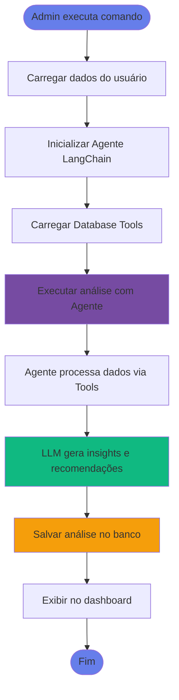
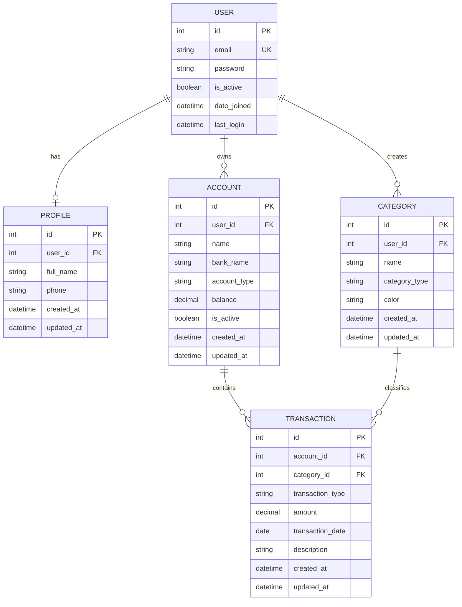

# Product Requirements Document (PRD) - Finanpy

## 1. Visão Geral

O Finanpy é um sistema de gestão de finanças pessoais desenvolvido com Python e Django, focado em simplicidade e eficiência. O projeto adota uma abordagem full-stack utilizando Django Template Language com TailwindCSS para o frontend, proporcionando uma experiência moderna e responsiva sem over-engineering.

## 2. Sobre o Produto

O Finanpy é uma aplicação web que permite aos usuários gerenciar suas finanças pessoais de forma intuitiva e organizada. O sistema oferece controle de contas bancárias, categorização de transações, visualização de entradas e saídas, e um dashboard centralizado para análise financeira. Com design moderno em tema escuro e gradientes harmônicos, o produto equilibra funcionalidade e estética.

## 3. Propósito

Fornecer uma ferramenta simples, eficiente e acessível para que pessoas possam organizar suas finanças pessoais, acompanhar receitas e despesas, categorizar transações e tomar decisões financeiras mais conscientes através de visualizações claras e objetivas.

## 4. Público Alvo

- **Perfil Primário**: Adultos entre 25-45 anos que buscam organizar suas finanças pessoais
- **Perfil Secundário**: Jovens profissionais iniciando sua independência financeira
- **Características Comuns**:
  - Possuem múltiplas contas bancárias
  - Necessitam controlar gastos mensais
  - Buscam simplicidade e praticidade
  - Têm acesso regular à internet
  - Preferem soluções diretas sem complexidade excessiva

## 5. Objetivos

### 5.1 Objetivos de Negócio
- Criar uma ferramenta MVP funcional de gestão financeira pessoal
- Estabelecer base de usuários engajados
- Demonstrar viabilidade técnica da solução

### 5.2 Objetivos de Produto
- Permitir cadastro e autenticação segura de usuários
- Possibilitar gerenciamento de múltiplas contas bancárias
- Facilitar registro e categorização de transações financeiras
- Fornecer visualização clara do panorama financeiro através de dashboard

### 5.3 Objetivos de Usuário
- Ter visão consolidada de todas as contas em um único lugar
- Categorizar e entender para onde o dinheiro está indo
- Controlar entradas e saídas de forma simples
- Acessar informações financeiras de forma rápida e intuitiva

## 6. Requisitos Funcionais

### 6.1 Agente de IA Financeiro

#### Visão Geral
O sistema incluirá um **agente de IA especializado em finanças pessoais** que analisará os dados financeiros de cada usuário e fornecerá **insights, dicas e recomendações personalizadas**. O agente utilizará LangChain 1.0 integrado com a API da OpenAI (modelo gpt-4o-mini) para processar transações, receitas, despesas e categorias, gerando análises contextualizadas e acionáveis.

#### Objetivos da Funcionalidade
- **Educação Financeira**: Fornecer dicas e insights que ajudem o usuário a entender melhor seus padrões de gasto
- **Personalização**: Análises baseadas exclusivamente nos dados reais do usuário
- **Ação**: Recomendações práticas e específicas que o usuário pode implementar imediatamente
- **Histórico**: Manter registro de análises anteriores para acompanhamento de evolução

#### Funcionalidades Principais

**RF043**: Sistema deve permitir geração de análise financeira personalizada via IA
- Análise deve considerar transações, receitas, despesas e categorias do usuário
- Análise deve identificar padrões de gasto e receita
- Análise deve fornecer recomendações específicas e acionáveis
- Análise deve ser executada sob demanda via comando Django

**RF044**: Sistema deve armazenar histórico de análises de IA
- Cada análise deve ser persistida no banco de dados
- Análises devem conter timestamp de criação
- Análises devem estar associadas ao usuário
- Sistema deve permitir consulta a análises anteriores

**RF045**: Sistema deve exibir última análise no dashboard
- Dashboard deve mostrar a análise mais recente
- Exibição deve ser clara e destacada
- Deve haver indicação de quando a análise foi gerada
- Deve haver botão para gerar nova análise

**RF046**: Sistema deve garantir isolamento de dados nas análises
- Agente IA deve acessar apenas dados do usuário específico
- Análises não devem vazar informações de outros usuários
- Tools do agente devem ter filtros por usuário

#### Arquitetura Técnica

**Stack de IA**:
- **Framework**: LangChain 1.0
- **LLM Provider**: OpenAI API
- **Modelo**: gpt-4o-mini
- **Integração**: LangChain Tools para acesso ao banco de dados Django

**Estrutura da App `ai/`**:
```
ai/
├── __init__.py
├── models.py                          # AIAnalysis model
├── admin.py                           # Admin para AIAnalysis
├── apps.py                            # Config da app
├── agents/
│   ├── __init__.py
│   ├── finance_insight_agent.py      # Agente LangChain principal
│   └── ai_integration_expert.md      # Documento de referência técnica
├── tools/
│   ├── __init__.py
│   └── database_tools.py             # LangChain Tools para queries
├── services/
│   ├── __init__.py
│   └── analysis_service.py           # Orquestração da análise
├── management/
│   └── commands/
│       ├── __init__.py
│       └── run_finance_analysis.py   # Django Command
└── migrations/
    └── __init__.py
```

**Model AIAnalysis**:
```python
class AIAnalysis(models.Model):
    user = models.ForeignKey(User, on_delete=models.CASCADE, related_name='ai_analyses')
    analysis_text = models.TextField()  # Análise completa gerada pela IA
    key_insights = models.JSONField(default=list)  # Lista de insights principais
    recommendations = models.JSONField(default=list)  # Lista de recomendações
    period_analyzed = models.CharField(max_length=100)  # Ex: "Últimos 30 dias"
    created_at = models.DateTimeField(auto_now_add=True)
    updated_at = models.DateTimeField(auto_now=True)
```

**LangChain Tools**:
O agente terá acesso às seguintes tools para consultar dados:
- `get_user_transactions`: Retorna transações do usuário com filtros
- `get_user_accounts`: Retorna contas bancárias do usuário
- `get_user_categories`: Retorna categorias do usuário
- `get_spending_by_category`: Retorna gastos agrupados por categoria
- `get_income_vs_expense`: Retorna comparativo receitas vs despesas

#### Fluxo de Execução


```mermaid
flowchart TD
    Start([Admin executa comando]) --> LoadUser[Carregar dados do usuário]
    LoadUser --> InitAgent[Inicializar Agente LangChain]
    InitAgent --> LoadTools[Carregar Database Tools]
    LoadTools --> Execute[Executar análise com Agente]
    Execute --> ProcessData[Agente processa dados via Tools]
    ProcessData --> GenerateInsights[LLM gera insights e recomendações]
    GenerateInsights --> SaveDB[Salvar análise no banco]
    SaveDB --> ShowDashboard[Exibir no dashboard]
    ShowDashboard --> End([Fim])

    style Start fill:#667eea
    style Execute fill:#764ba2
    style GenerateInsights fill:#10b981
    style SaveDB fill:#f59e0b
    style End fill:#667eea
```

#### Exemplo de Análise Gerada

**Entrada** (dados do usuário):
- 45 transações no último mês
- 3 contas bancárias
- Receita total: R$ 5.000,00
- Despesas totais: R$ 4.200,00
- Principais categorias: Alimentação (R$ 1.200), Transporte (R$ 800), Lazer (R$ 600)

**Saída** (análise IA):
```
Olá! Analisando suas finanças dos últimos 30 dias, identifiquei alguns pontos importantes:

📊 Visão Geral:
- Você teve um saldo positivo de R$ 800,00 neste mês, o que é excelente!
- Suas despesas representaram 84% da sua receita.

🔍 Insights Principais:
1. Alimentação é seu maior gasto (28,5% do total) com R$ 1.200,00
2. Você gastou R$ 600,00 com lazer - 14,3% das despesas
3. Seus gastos com transporte foram de R$ 800,00 (19% do total)

💡 Recomendações:
1. Considere preparar mais refeições em casa para reduzir gastos com alimentação
2. Seus gastos com lazer estão equilibrados, mas há espaço para otimização
3. Avalie alternativas de transporte mais econômicas (transporte público, carona)
4. Com sua taxa de poupança atual (16%), você economizará R$ 9.600,00 por ano

🎯 Meta Sugerida:
Tente reduzir 10% dos gastos com alimentação no próximo mês (economizando R$ 120).
Isso elevaria sua taxa de poupança para 18,4%.
```

#### Execução da Análise

**Django Command**:
```bash
# Gerar análise para usuário específico
python manage.py run_finance_analysis --user-email user@example.com

# Gerar análise para todos os usuários
python manage.py run_finance_analysis --all
```

#### Configuração Necessária

**Variáveis de Ambiente**:
```env
OPENAI_API_KEY=sk-xxx  # API key da OpenAI
AI_MODEL=gpt-4o-mini    # Modelo a ser utilizado
AI_MAX_TOKENS=1000      # Limite de tokens por análise
AI_TEMPERATURE=0.7      # Criatividade do modelo (0-1)
```

**Requirements.txt** (novas dependências):
```
langchain==0.3.28
langchain-openai==0.3.0
langchain-community==0.3.28
openai==1.59.5
```

#### Segurança e Privacidade

- **Isolamento de Dados**: Tools sempre filtram por `user=request.user`
- **Não Persistência de Prompts**: Prompts intermediários não são salvos
- **Rate Limiting**: Limite de 1 análise por usuário a cada 24h
- **API Key**: Armazenada em variável de ambiente, nunca em código
- **Logs**: Não registrar dados financeiros sensíveis em logs

#### Limitações da MVP

**O que NÃO será implementado nesta versão**:
- Interface web para solicitar análise (apenas comando)
- Análises agendadas automaticamente
- Comparação com outros usuários ou benchmarks
- Alertas proativos via email/notificações
- Gráficos ou visualizações dentro da análise
- Perguntas interativas ao agente (chat)
- Múltiplos idiomas (apenas português)

#### Expansões Futuras

**Roadmap pós-MVP**:
- **Sprint 9**: Botão no dashboard para gerar análise via interface
- **Sprint 10**: Análises automáticas agendadas (semanais/mensais)
- **Sprint 11**: Chat interativo com o agente financeiro
- **Sprint 12**: Alertas inteligentes (gastos anormais, metas atingidas)
- **Sprint 13**: Previsões e projeções financeiras
- **Sprint 14**: Integração com Open Banking (dados reais de bancos)

#### Métricas de Sucesso

**KPIs**:
- Taxa de usuários que geram análises: > 30%
- Satisfação com insights (pesquisa): > 70%
- Tempo médio de geração de análise: < 30 segundos
- Precisão das recomendações (feedback): > 80%
- Taxa de implementação de recomendações: > 20%

#### Referências Técnicas

**Documentação**:
- [LangChain Documentation](https://python.langchain.com/docs/get_started/introduction) - via Context7 MCP
- [OpenAI API Reference](https://platform.openai.com/docs/api-reference)
- Django ORM para Tools
- Design patterns para agentes LangChain

---

### 6.2 Autenticação e Usuários
- RF001: Sistema deve permitir cadastro de novos usuários com email e senha
- RF002: Sistema deve permitir login de usuários através do email
- RF003: Sistema deve permitir logout de usuários
- RF004: Sistema deve validar formato de email e força de senha
- RF005: Sistema deve impedir cadastro de emails duplicados

### 6.3 Gestão de Perfis
- RF006: Sistema deve criar perfil automaticamente ao cadastrar usuário
- RF007: Sistema deve permitir visualização de dados do perfil
- RF008: Sistema deve permitir edição de informações do perfil

### 6.4 Gestão de Contas Bancárias
- RF009: Sistema deve permitir cadastro de contas bancárias
- RF010: Sistema deve permitir listagem de todas as contas do usuário
- RF011: Sistema deve permitir edição de dados de contas
- RF012: Sistema deve permitir exclusão de contas
- RF013: Sistema deve exibir saldo atual de cada conta
- RF014: Sistema deve associar contas ao usuário logado

### 6.5 Gestão de Categorias
- RF015: Sistema deve permitir cadastro de categorias de transações
- RF016: Sistema deve permitir listagem de categorias do usuário
- RF017: Sistema deve permitir edição de categorias
- RF018: Sistema deve permitir exclusão de categorias
- RF019: Sistema deve diferenciar categorias de entrada e saída

### 6.6 Gestão de Transações
- RF020: Sistema deve permitir registro de transações de entrada
- RF021: Sistema deve permitir registro de transações de saída
- RF022: Sistema deve associar transação a uma conta bancária
- RF023: Sistema deve associar transação a uma categoria
- RF024: Sistema deve registrar data da transação
- RF025: Sistema deve permitir adicionar descrição à transação
- RF026: Sistema deve permitir listagem de transações do usuário
- RF027: Sistema deve permitir filtrar transações por período
- RF028: Sistema deve permitir filtrar transações por conta
- RF029: Sistema deve permitir filtrar transações por categoria
- RF030: Sistema deve permitir edição de transações
- RF031: Sistema deve permitir exclusão de transações

### 6.7 Dashboard
- RF032: Sistema deve exibir saldo total consolidado de todas as contas
- RF033: Sistema deve exibir total de entradas do período atual
- RF034: Sistema deve exibir total de saídas do período atual
- RF035: Sistema deve exibir balanço (entradas - saídas) do período
- RF036: Sistema deve exibir lista de transações recentes
- RF037: Sistema deve exibir resumo por categorias

### 6.8 Site Público
- RF038: Sistema deve ter página inicial pública de apresentação
- RF039: Página inicial deve ter botão de cadastro
- RF040: Página inicial deve ter botão de login
- RF041: Usuários não autenticados devem ser redirecionados ao site público
- RF042: Usuários autenticados devem ser redirecionados ao dashboard

### 6.9 Flowchart - Fluxos de UX


```mermaid
flowchart TD
    Start([Usuário acessa site]) --> CheckAuth{Usuário<br/>autenticado?}
    
    CheckAuth -->|Não| PublicHome[Página Inicial Pública]
    CheckAuth -->|Sim| Dashboard[Dashboard]
    
    PublicHome --> ActionChoice{Escolhe ação}
    ActionChoice -->|Cadastrar| RegisterForm[Formulário de Cadastro]
    ActionChoice -->|Login| LoginForm[Formulário de Login]
    
    RegisterForm --> ValidateReg{Dados<br/>válidos?}
    ValidateReg -->|Não| RegisterForm
    ValidateReg -->|Sim| CreateUser[Criar Usuário e Perfil]
    CreateUser --> AutoLogin[Login Automático]
    AutoLogin --> Dashboard
    
    LoginForm --> ValidateLogin{Credenciais<br/>válidas?}
    ValidateLogin -->|Não| LoginForm
    ValidateLogin -->|Sim| Dashboard
    
    Dashboard --> DashActions{Ação no Dashboard}
    
    DashActions -->|Gerenciar Contas| AccountsList[Lista de Contas]
    AccountsList --> AccActions{Ação}
    AccActions -->|Criar| CreateAccount[Criar Conta]
    AccActions -->|Editar| EditAccount[Editar Conta]
    AccActions -->|Excluir| DeleteAccount[Excluir Conta]
    AccActions -->|Voltar| Dashboard
    CreateAccount --> AccountsList
    EditAccount --> AccountsList
    DeleteAccount --> AccountsList
    
    DashActions -->|Gerenciar Categorias| CategoriesList[Lista de Categorias]
    CategoriesList --> CatActions{Ação}
    CatActions -->|Criar| CreateCategory[Criar Categoria]
    CatActions -->|Editar| EditCategory[Editar Categoria]
    CatActions -->|Excluir| DeleteCategory[Excluir Categoria]
    CatActions -->|Voltar| Dashboard
    CreateCategory --> CategoriesList
    EditCategory --> CategoriesList
    DeleteCategory --> CategoriesList
    
    DashActions -->|Gerenciar Transações| TransactionsList[Lista de Transações]
    TransactionsList --> TransActions{Ação}
    TransActions -->|Criar| CreateTransaction[Criar Transação]
    TransActions -->|Editar| EditTransaction[Editar Transação]
    TransActions -->|Excluir| DeleteTransaction[Excluir Transação]
    TransActions -->|Filtrar| FilterTransactions[Filtrar Transações]
    TransActions -->|Voltar| Dashboard
    CreateTransaction --> TransactionsList
    EditTransaction --> TransactionsList
    DeleteTransaction --> TransactionsList
    FilterTransactions --> TransactionsList
    
    DashActions -->|Ver Perfil| ProfileView[Visualizar Perfil]
    ProfileView --> ProfileActions{Ação}
    ProfileActions -->|Editar| EditProfile[Editar Perfil]
    ProfileActions -->|Voltar| Dashboard
    EditProfile --> ProfileView
    
    DashActions -->|Logout| Logout[Fazer Logout]
    Logout --> PublicHome
    
    style Dashboard fill:#2d5a3d
    style PublicHome fill:#1e3a5f
    style CreateUser fill:#4a5d23
    style AutoLogin fill:#4a5d23
```

## 7. Requisitos Não-Funcionais

### 7.1 Performance
- RNF001: Páginas devem carregar em menos de 2 segundos
- RNF002: Dashboard deve consolidar dados em tempo aceitável (<1s)
- RNF003: Sistema deve suportar pelo menos 100 usuários simultâneos

### 7.2 Segurança
- RNF004: Senhas devem ser armazenadas com hash seguro (Django padrão)
- RNF005: Sistema deve proteger rotas autenticadas
- RNF006: Dados de um usuário não devem ser acessíveis por outros
- RNF007: Sessões devem expirar após período de inatividade

### 7.3 Usabilidade
- RNF008: Interface deve ser responsiva para desktop, tablet e mobile
- RNF009: Design deve seguir padrões de acessibilidade básicos
- RNF010: Mensagens de erro devem ser claras e em português
- RNF011: Interface deve ter feedback visual para ações do usuário

### 7.4 Manutenibilidade
- RNF012: Código deve seguir PEP 8
- RNF013: Código deve usar aspas simples
- RNF014: Código deve ser escrito em inglês
- RNF015: Apps devem ter responsabilidades bem definidas
- RNF016: Models devem ter campos created_at e updated_at

### 7.5 Compatibilidade
- RNF017: Sistema deve funcionar nos principais navegadores (Chrome, Firefox, Safari, Edge)
- RNF018: Interface deve ser responsiva para resoluções a partir de 320px

### 7.6 Escalabilidade
- RNF019: Arquitetura deve permitir migração futura para PostgreSQL
- RNF020: Estrutura deve facilitar adição de novos módulos

## 8. Arquitetura Técnica

### 8.1 Stack Tecnológica

#### Backend
- **Linguagem**: Python 3.13+
- **Framework**: Django 5+
- **Banco de Dados**: SQLite3 (padrão Django)
- **Autenticação**: Django Auth (nativo)

#### Frontend
- **Template Engine**: Django Template Language
- **CSS Framework**: TailwindCSS
- **JavaScript**: Vanilla JS (mínimo necessário)

#### Infraestrutura
- **Servidor Web**: Django Development Server (desenvolvimento)
- **Ambiente Virtual**: venv
- **Gerenciador de Pacotes**: pip

### 8.2 Estrutura de Dados


```mermaid
erDiagram
    USER ||--o| PROFILE : has
    USER ||--o{ ACCOUNT : owns
    USER ||--o{ CATEGORY : creates
    ACCOUNT ||--o{ TRANSACTION : contains
    CATEGORY ||--o{ TRANSACTION : classifies
    
    USER {
        int id PK
        string email UK
        string password
        boolean is_active
        datetime date_joined
        datetime last_login
    }
    
    PROFILE {
        int id PK
        int user_id FK
        string full_name
        string phone
        datetime created_at
        datetime updated_at
    }
    
    ACCOUNT {
        int id PK
        int user_id FK
        string name
        string bank_name
        string account_type
        decimal balance
        boolean is_active
        datetime created_at
        datetime updated_at
    }
    
    CATEGORY {
        int id PK
        int user_id FK
        string name
        string category_type
        string color
        datetime created_at
        datetime updated_at
    }
    
    TRANSACTION {
        int id PK
        int account_id FK
        int category_id FK
        string transaction_type
        decimal amount
        date transaction_date
        string description
        datetime created_at
        datetime updated_at
    }
```

### 8.3 Estrutura de Apps Django

```
finanpy/
├── core/           # Configurações globais e URLs principais
├── users/          # Extensão do User model do Django
├── profiles/       # Perfis de usuários
├── accounts/       # Contas bancárias
├── categories/     # Categorias de transações
├── transactions/   # Transações financeiras
└── static/         # Arquivos estáticos (CSS, JS, imagens)
```

## 9. Design System

### 9.1 Paleta de Cores

#### Cores Primárias
```css
/* Gradiente Principal */
primary-gradient: linear-gradient(135deg, #667eea 0%, #764ba2 100%)

/* Cores Sólidas */
primary-500: #667eea
primary-600: #5568d3
primary-700: #4453bd

accent-500: #764ba2
accent-600: #63418a
accent-700: #503672
```

#### Cores de Fundo
```css
/* Tema Escuro */
bg-primary: #0f172a      /* Fundo principal */
bg-secondary: #1e293b    /* Fundo de cards */
bg-tertiary: #334155     /* Fundo de hover */

/* Cores de Texto */
text-primary: #f1f5f9    /* Texto principal */
text-secondary: #cbd5e1  /* Texto secundário */
text-muted: #64748b      /* Texto menos importante */
```

#### Cores de Estado
```css
success: #10b981    /* Verde para entradas/sucesso */
error: #ef4444      /* Vermelho para saídas/erros */
warning: #f59e0b    /* Amarelo para avisos */
info: #3b82f6       /* Azul para informações */
```

### 9.2 Tipografia

```css
/* Fonte Principal */
font-family: 'Inter', system-ui, -apple-system, sans-serif

/* Tamanhos */
text-xs: 0.75rem      /* 12px */
text-sm: 0.875rem     /* 14px */
text-base: 1rem       /* 16px */
text-lg: 1.125rem     /* 18px */
text-xl: 1.25rem      /* 20px */
text-2xl: 1.5rem      /* 24px */
text-3xl: 1.875rem    /* 30px */
text-4xl: 2.25rem     /* 36px */

/* Pesos */
font-normal: 400
font-medium: 500
font-semibold: 600
font-bold: 700
```

### 9.3 Componentes

#### Botões

```html
<!-- Botão Primário -->
<button class="px-6 py-3 bg-gradient-to-r from-primary-500 to-accent-500 text-white rounded-lg font-medium hover:from-primary-600 hover:to-accent-600 transition-all duration-200 shadow-lg hover:shadow-xl">
    Texto do Botão
</button>

<!-- Botão Secundário -->
<button class="px-6 py-3 bg-bg-secondary text-text-primary rounded-lg font-medium hover:bg-bg-tertiary transition-all duration-200 border border-bg-tertiary">
    Texto do Botão
</button>

<!-- Botão de Sucesso -->
<button class="px-6 py-3 bg-success text-white rounded-lg font-medium hover:bg-green-600 transition-all duration-200">
    Salvar
</button>

<!-- Botão de Erro -->
<button class="px-6 py-3 bg-error text-white rounded-lg font-medium hover:bg-red-600 transition-all duration-200">
    Excluir
</button>

<!-- Botão Pequeno -->
<button class="px-4 py-2 text-sm bg-gradient-to-r from-primary-500 to-accent-500 text-white rounded-md font-medium hover:from-primary-600 hover:to-accent-600 transition-all duration-200">
    Ação
</button>
```

#### Inputs e Forms

```html
<!-- Input Padrão -->
<div class="mb-4">
    <label class="block text-text-secondary text-sm font-medium mb-2">
        Label do Campo
    </label>
    <input type="text" class="w-full px-4 py-3 bg-bg-secondary border border-bg-tertiary rounded-lg text-text-primary focus:outline-none focus:ring-2 focus:ring-primary-500 focus:border-transparent transition-all duration-200" placeholder="Digite aqui...">
</div>

<!-- Select -->
<div class="mb-4">
    <label class="block text-text-secondary text-sm font-medium mb-2">
        Selecione uma opção
    </label>
    <select class="w-full px-4 py-3 bg-bg-secondary border border-bg-tertiary rounded-lg text-text-primary focus:outline-none focus:ring-2 focus:ring-primary-500 focus:border-transparent transition-all duration-200">
        <option>Opção 1</option>
        <option>Opção 2</option>
    </select>
</div>

<!-- Textarea -->
<div class="mb-4">
    <label class="block text-text-secondary text-sm font-medium mb-2">
        Descrição
    </label>
    <textarea rows="4" class="w-full px-4 py-3 bg-bg-secondary border border-bg-tertiary rounded-lg text-text-primary focus:outline-none focus:ring-2 focus:ring-primary-500 focus:border-transparent transition-all duration-200" placeholder="Digite aqui..."></textarea>
</div>
```

#### Cards

```html
<!-- Card Padrão -->
<div class="bg-bg-secondary rounded-xl p-6 shadow-lg border border-bg-tertiary">
    <h3 class="text-xl font-semibold text-text-primary mb-4">Título do Card</h3>
    <p class="text-text-secondary">Conteúdo do card aqui...</p>
</div>

<!-- Card com Gradiente -->
<div class="bg-gradient-to-br from-primary-500 to-accent-500 rounded-xl p-6 shadow-xl">
    <h3 class="text-xl font-semibold text-white mb-2">Saldo Total</h3>
    <p class="text-3xl font-bold text-white">R$ 10.500,00</p>
</div>

<!-- Card de Estatística -->
<div class="bg-bg-secondary rounded-xl p-6 shadow-lg border border-bg-tertiary hover:border-primary-500 transition-all duration-200">
    <div class="flex items-center justify-between mb-2">
        <span class="text-text-secondary text-sm font-medium">Entradas</span>
        <span class="text-success text-sm">↑</span>
    </div>
    <p class="text-2xl font-bold text-text-primary">R$ 5.200,00</p>
    <p class="text-text-muted text-xs mt-1">+12% vs mês anterior</p>
</div>
```

#### Tabelas

```html
<div class="bg-bg-secondary rounded-xl shadow-lg border border-bg-tertiary overflow-hidden">
    <table class="w-full">
        <thead>
            <tr class="bg-bg-tertiary">
                <th class="px-6 py-4 text-left text-text-secondary text-sm font-semibold">Coluna 1</th>
                <th class="px-6 py-4 text-left text-text-secondary text-sm font-semibold">Coluna 2</th>
                <th class="px-6 py-4 text-left text-text-secondary text-sm font-semibold">Ações</th>
            </tr>
        </thead>
        <tbody>
            <tr class="border-t border-bg-tertiary hover:bg-bg-tertiary transition-all duration-150">
                <td class="px-6 py-4 text-text-primary">Dado 1</td>
                <td class="px-6 py-4 text-text-primary">Dado 2</td>
                <td class="px-6 py-4">
                    <button class="text-primary-500 hover:text-primary-400 text-sm font-medium">Editar</button>
                </td>
            </tr>
        </tbody>
    </table>
</div>
```

#### Menu de Navegação

```html
<!-- Navbar -->
<nav class="bg-bg-secondary border-b border-bg-tertiary shadow-lg">
    <div class="max-w-7xl mx-auto px-4 sm:px-6 lg:px-8">
        <div class="flex items-center justify-between h-16">
            <div class="flex items-center">
                <span class="text-2xl font-bold bg-gradient-to-r from-primary-500 to-accent-500 bg-clip-text text-transparent">
                    Finanpy
                </span>
            </div>
            <div class="flex items-center space-x-4">
                <a href="#" class="text-text-secondary hover:text-text-primary transition-colors duration-200">Dashboard</a>
                <a href="#" class="text-text-secondary hover:text-text-primary transition-colors duration-200">Contas</a>
                <a href="#" class="text-text-secondary hover:text-text-primary transition-colors duration-200">Transações</a>
                <button class="px-4 py-2 bg-error text-white rounded-lg text-sm font-medium hover:bg-red-600 transition-all duration-200">
                    Sair
                </button>
            </div>
        </div>
    </div>
</nav>

<!-- Sidebar (opcional) -->
<aside class="w-64 bg-bg-secondary h-screen fixed left-0 top-0 border-r border-bg-tertiary p-6">
    <div class="mb-8">
        <span class="text-2xl font-bold bg-gradient-to-r from-primary-500 to-accent-500 bg-clip-text text-transparent">
            Finanpy
        </span>
    </div>
    <nav class="space-y-2">
        <a href="#" class="flex items-center px-4 py-3 text-text-primary bg-bg-tertiary rounded-lg font-medium">
            Dashboard
        </a>
        <a href="#" class="flex items-center px-4 py-3 text-text-secondary hover:text-text-primary hover:bg-bg-tertiary rounded-lg transition-all duration-200">
            Contas
        </a>
        <a href="#" class="flex items-center px-4 py-3 text-text-secondary hover:text-text-primary hover:bg-bg-tertiary rounded-lg transition-all duration-200">
            Categorias
        </a>
        <a href="#" class="flex items-center px-4 py-3 text-text-secondary hover:text-text-primary hover:bg-bg-tertiary rounded-lg transition-all duration-200">
            Transações
        </a>
    </nav>
</aside>
```

#### Alertas e Mensagens

```html
<!-- Sucesso -->
<div class="bg-success/10 border border-success/20 rounded-lg p-4 mb-4">
    <p class="text-success font-medium">Operação realizada com sucesso!</p>
</div>

<!-- Erro -->
<div class="bg-error/10 border border-error/20 rounded-lg p-4 mb-4">
    <p class="text-error font-medium">Ocorreu um erro. Tente novamente.</p>
</div>

<!-- Aviso -->
<div class="bg-warning/10 border border-warning/20 rounded-lg p-4 mb-4">
    <p class="text-warning font-medium">Atenção: verifique os dados informados.</p>
</div>

<!-- Informação -->
<div class="bg-info/10 border border-info/20 rounded-lg p-4 mb-4">
    <p class="text-info font-medium">Informação importante sobre o sistema.</p>
</div>
```

### 9.4 Grid e Layout

```html
<!-- Container Principal -->
<div class="max-w-7xl mx-auto px-4 sm:px-6 lg:px-8 py-8">
    <!-- Conteúdo -->
</div>

<!-- Grid 2 Colunas -->
<div class="grid grid-cols-1 md:grid-cols-2 gap-6">
    <div>Coluna 1</div>
    <div>Coluna 2</div>
</div>

<!-- Grid 3 Colunas -->
<div class="grid grid-cols-1 md:grid-cols-2 lg:grid-cols-3 gap-6">
    <div>Coluna 1</div>
    <div>Coluna 2</div>
    <div>Coluna 3</div>
</div>

<!-- Grid 4 Colunas -->
<div class="grid grid-cols-1 sm:grid-cols-2 lg:grid-cols-4 gap-6">
    <div>Coluna 1</div>
    <div>Coluna 2</div>
    <div>Coluna 3</div>
    <div>Coluna 4</div>
</div>
```

### 9.5 Espaçamentos Padrão

```css
/* Padding e Margin */
spacing-1: 0.25rem   /* 4px */
spacing-2: 0.5rem    /* 8px */
spacing-3: 0.75rem   /* 12px */
spacing-4: 1rem      /* 16px */
spacing-6: 1.5rem    /* 24px */
spacing-8: 2rem      /* 32px */
spacing-12: 3rem     /* 48px */
spacing-16: 4rem     /* 64px */

/* Bordas Arredondadas */
rounded-md: 0.375rem   /* 6px */
rounded-lg: 0.5rem     /* 8px */
rounded-xl: 0.75rem    /* 12px */
rounded-2xl: 1rem      /* 16px */
```

## 10. User Stories

### Épico 1: Autenticação e Cadastro

#### US1.1: Cadastro de Novo Usuário
**Como** visitante  
**Quero** criar uma conta no sistema  
**Para** começar a gerenciar minhas finanças pessoais

**Critérios de Aceite:**
- [ ] Formulário de cadastro deve solicitar email e senha
- [ ] Email deve ser validado quanto ao formato
- [ ] Senha deve ter no mínimo 8 caracteres
- [ ] Sistema deve impedir cadastro com email já existente
- [ ] Perfil deve ser criado automaticamente após cadastro
- [ ] Usuário deve ser redirecionado ao dashboard após cadastro
- [ ] Mensagem de sucesso deve ser exibida

#### US1.2: Login de Usuário
**Como** usuário cadastrado  
**Quero** fazer login no sistema com meu email  
**Para** acessar minhas informações financeiras

**Critérios de Aceite:**
- [ ] Formulário deve aceitar email e senha
- [ ] Sistema deve validar credenciais
- [ ] Mensagem de erro clara deve ser exibida para credenciais inválidas
- [ ] Usuário deve ser redirecionado ao dashboard após login bem-sucedido
- [ ] Sessão deve ser mantida até logout ou timeout

#### US1.3: Logout de Usuário
**Como** usuário logado  
**Quero** sair do sistema  
**Para** proteger minhas informações

**Critérios de Aceite:**
- [ ] Botão de logout deve estar visível em todas as páginas
- [ ] Sessão deve ser encerrada ao clicar em logout
- [ ] Usuário deve ser redirecionado à página inicial pública
- [ ] Confirmação de logout não é necessária

### Épico 2: Gestão de Perfil

#### US2.1: Visualização de Perfil
**Como** usuário logado  
**Quero** visualizar os dados do meu perfil  
**Para** confirmar minhas informações cadastradas

**Critérios de Aceite:**
- [ ] Página deve exibir nome completo
- [ ] Página deve exibir telefone
- [ ] Página deve exibir email (não editável)
- [ ] Página deve ter botão para editar perfil

#### US2.2: Edição de Perfil
**Como** usuário logado  
**Quero** editar os dados do meu perfil  
**Para** manter minhas informações atualizadas

**Critérios de Aceite:**
- [ ] Formulário deve permitir edição de nome completo
- [ ] Formulário deve permitir edição de telefone
- [ ] Validações devem ser aplicadas aos campos
- [ ] Mensagem de sucesso deve ser exibida após salvar
- [ ] Dados devem ser atualizados no banco de dados

### Épico 3: Gestão de Contas Bancárias

#### US3.1: Cadastro de Conta Bancária
**Como** usuário logado  
**Quero** cadastrar uma nova conta bancária  
**Para** registrar transações nesta conta

**Critérios de Aceite:**
- [ ] Formulário deve solicitar nome da conta
- [ ] Formulário deve solicitar nome do banco
- [ ] Formulário deve solicitar tipo de conta (corrente, poupança, carteira)
- [ ] Formulário deve solicitar saldo inicial
- [ ] Conta deve ser associada ao usuário logado
- [ ] Conta deve ser criada como ativa por padrão
- [ ] Mensagem de sucesso deve ser exibida

#### US3.2: Listagem de Contas
**Como** usuário logado  
**Quero** ver todas as minhas contas cadastradas  
**Para** ter visão geral das minhas contas

**Critérios de Aceite:**
- [ ] Lista deve exibir nome da conta
- [ ] Lista deve exibir nome do banco
- [ ] Lista deve exibir tipo de conta
- [ ] Lista deve exibir saldo atual
- [ ] Lista deve exibir apenas contas do usuário logado
- [ ] Deve haver botão para cadastrar nova conta
- [ ] Cada item deve ter opções de editar e excluir

#### US3.3: Edição de Conta
**Como** usuário logado  
**Quero** editar dados de uma conta  
**Para** corrigir ou atualizar informações

**Critérios de Aceite:**
- [ ] Formulário deve vir preenchido com dados atuais
- [ ] Todos os campos devem ser editáveis
- [ ] Validações devem ser aplicadas
- [ ] Mensagem de sucesso deve ser exibida após salvar

#### US3.4: Exclusão de Conta
**Como** usuário logado  
**Quero** excluir uma conta  
**Para** remover contas que não uso mais

**Critérios de Aceite:**
- [ ] Sistema deve solicitar confirmação antes de excluir
- [ ] Conta deve ser excluída permanentemente (ou desativada)
- [ ] Mensagem de sucesso deve ser exibida
- [ ] Transações da conta devem ser tratadas (manter registro histórico)

### Épico 4: Gestão de Categorias

#### US4.1: Cadastro de Categoria
**Como** usuário logado  
**Quero** criar categorias personalizadas  
**Para** organizar minhas transações

**Critérios de Aceite:**
- [ ] Formulário deve solicitar nome da categoria
- [ ] Formulário deve solicitar tipo (entrada ou saída)
- [ ] Formulário deve permitir escolher cor
- [ ] Categoria deve ser associada ao usuário
- [ ] Mensagem de sucesso deve ser exibida

#### US4.2: Listagem de Categorias
**Como** usuário logado  
**Quero** ver todas as minhas categorias  
**Para** gerenciar como organizo minhas transações

**Critérios de Aceite:**
- [ ] Lista deve exibir nome da categoria
- [ ] Lista deve indicar se é entrada ou saída
- [ ] Lista deve mostrar cor associada
- [ ] Lista deve exibir apenas categorias do usuário
- [ ] Deve haver botão para criar nova categoria
- [ ] Cada item deve ter opções de editar e excluir

#### US4.3: Edição de Categoria
**Como** usuário logado  
**Quero** editar uma categoria  
**Para** ajustar nome, tipo ou cor

**Critérios de Aceite:**
- [ ] Formulário deve vir preenchido
- [ ] Todos os campos devem ser editáveis
- [ ] Mensagem de sucesso deve ser exibida

#### US4.4: Exclusão de Categoria
**Como** usuário logado  
**Quero** excluir categorias não utilizadas  
**Para** manter apenas categorias relevantes

**Critérios de Aceite:**
- [ ] Sistema deve solicitar confirmação
- [ ] Categoria deve ser excluída
- [ ] Transações com esta categoria devem ser tratadas
- [ ] Mensagem de sucesso deve ser exibida

### Épico 5: Gestão de Transações

#### US5.1: Registro de Transação de Entrada
**Como** usuário logado  
**Quero** registrar uma entrada de dinheiro  
**Para** controlar minhas receitas

**Critérios de Aceite:**
- [ ] Formulário deve solicitar conta
- [ ] Formulário deve solicitar categoria
- [ ] Formulário deve solicitar valor
- [ ] Formulário deve solicitar data
- [ ] Formulário deve solicitar descrição (opcional)
- [ ] Tipo deve ser definido como "entrada"
- [ ] Saldo da conta deve ser atualizado
- [ ] Mensagem de sucesso deve ser exibida

#### US5.2: Registro de Transação de Saída
**Como** usuário logado  
**Quero** registrar uma saída de dinheiro  
**Para** controlar minhas despesas

**Critérios de Aceite:**
- [ ] Formulário deve solicitar conta
- [ ] Formulário deve solicitar categoria
- [ ] Formulário deve solicitar valor
- [ ] Formulário deve solicitar data
- [ ] Formulário deve solicitar descrição (opcional)
- [ ] Tipo deve ser definido como "saída"
- [ ] Saldo da conta deve ser atualizado
- [ ] Mensagem de sucesso deve ser exibida

#### US5.3: Listagem de Transações
**Como** usuário logado  
**Quero** ver todas as minhas transações  
**Para** acompanhar meu histórico financeiro

**Critérios de Aceite:**
- [ ] Lista deve exibir data da transação
- [ ] Lista deve exibir descrição
- [ ] Lista deve exibir conta
- [ ] Lista deve exibir categoria
- [ ] Lista deve exibir valor
- [ ] Lista deve indicar se é entrada ou saída (cores diferentes)
- [ ] Lista deve ser ordenada por data (mais recente primeiro)
- [ ] Deve haver botão para registrar nova transação
- [ ] Cada item deve ter opções de editar e excluir

#### US5.4: Filtragem de Transações
**Como** usuário logado  
**Quero** filtrar transações por período, conta ou categoria  
**Para** analisar movimentações específicas

**Critérios de Aceite:**
- [ ] Deve haver filtro por período (data inicial e final)
- [ ] Deve haver filtro por conta
- [ ] Deve haver filtro por categoria
- [ ] Filtros devem poder ser combinados
- [ ] Deve haver botão para limpar filtros
- [ ] Resultados devem atualizar ao aplicar filtros

#### US5.5: Edição de Transação
**Como** usuário logado  
**Quero** editar uma transação  
**Para** corrigir informações registradas incorretamente

**Critérios de Aceite:**
- [ ] Formulário deve vir preenchido
- [ ] Todos os campos devem ser editáveis
- [ ] Saldo das contas deve ser recalculado
- [ ] Mensagem de sucesso deve ser exibida

#### US5.6: Exclusão de Transação
**Como** usuário logado  
**Quero** excluir uma transação  
**Para** remover lançamentos duplicados ou incorretos

**Critérios de Aceite:**
- [ ] Sistema deve solicitar confirmação
- [ ] Transação deve ser excluída
- [ ] Saldo da conta deve ser recalculado
- [ ] Mensagem de sucesso deve ser exibida

### Épico 6: Dashboard e Visualização

#### US6.1: Visualização do Dashboard
**Como** usuário logado  
**Quero** ver um resumo das minhas finanças  
**Para** ter visão geral da minha situação financeira

**Critérios de Aceite:**
- [ ] Dashboard deve exibir saldo total consolidado
- [ ] Dashboard deve exibir total de entradas do mês
- [ ] Dashboard deve exibir total de saídas do mês
- [ ] Dashboard deve exibir balanço do mês (entradas - saídas)
- [ ] Dashboard deve exibir lista das últimas transações
- [ ] Dashboard deve exibir resumo por categorias
- [ ] Valores devem ser formatados em reais (R$)
- [ ] Entradas devem ter cor verde
- [ ] Saídas devem ter cor vermelha

#### US6.2: Acesso Rápido a Funcionalidades
**Como** usuário logado  
**Quero** acessar rapidamente as principais funcionalidades  
**Para** navegar eficientemente pelo sistema

**Critérios de Aceite:**
- [ ] Dashboard deve ter botões de acesso rápido
- [ ] Deve haver botão para nova transação
- [ ] Deve haver botão para nova conta
- [ ] Deve haver botão para nova categoria
- [ ] Menu de navegação deve estar sempre visível

### Épico 7: Site Público

#### US7.1: Página Inicial Pública
**Como** visitante  
**Quero** ver informações sobre o sistema  
**Para** decidir se quero me cadastrar

**Critérios de Aceite:**
- [ ] Página deve apresentar o Finanpy
- [ ] Página deve listar principais funcionalidades
- [ ] Página deve ter design atrativo e moderno
- [ ] Deve haver botão de cadastro destacado
- [ ] Deve haver botão de login
- [ ] Usuários autenticados devem ser redirecionados ao dashboard

## 11. Métricas de Sucesso

### 11.1 KPIs de Produto

#### Adoção e Uso
- **Taxa de Conversão de Cadastro**: % de visitantes que completam cadastro
  - Meta: > 15%
- **Usuários Ativos Diários (DAU)**: Usuários que acessam o sistema por dia
  - Meta: > 60% dos usuários cadastrados
- **Usuários Ativos Mensais (MAU)**: Usuários que acessam o sistema por mês
  - Meta: > 80% dos usuários cadastrados
- **Taxa de Retenção**: % de usuários que retornam após primeiro acesso
  - Meta: > 70% em 30 dias

#### Engajamento
- **Média de Transações por Usuário**: Número de transações registradas por usuário
  - Meta: > 15 transações/mês
- **Tempo Médio de Sessão**: Tempo que usuário passa no sistema
  - Meta: > 5 minutos
- **Frequência de Acesso**: Quantas vezes o usuário acessa por semana
  - Meta: > 3 acessos/semana

#### Performance
- **Tempo de Carregamento de Páginas**: Tempo para página carregar completamente
  - Meta: < 2 segundos
- **Taxa de Erro**: % de requisições que resultam em erro
  - Meta: < 1%
- **Disponibilidade do Sistema**: % de tempo que sistema está disponível
  - Meta: > 99%

### 11.2 KPIs de Usuário

#### Satisfação
- **Net Promoter Score (NPS)**: Probabilidade de recomendar o sistema
  - Meta: > 50
- **Taxa de Abandono**: % de usuários que param de usar o sistema
  - Meta: < 20% ao mês
- **Feedback Positivo**: % de avaliações positivas
  - Meta: > 80%

#### Comportamento
- **Contas por Usuário**: Número médio de contas cadastradas
  - Meta: > 2 contas
- **Categorias por Usuário**: Número médio de categorias criadas
  - Meta: > 5 categorias
- **Completude de Perfil**: % de usuários com perfil completo
  - Meta: > 90%

### 11.3 KPIs de Negócio

#### Crescimento
- **Taxa de Crescimento de Usuários**: % de aumento de usuários por mês
  - Meta: > 20% ao mês
- **Custo de Aquisição de Cliente (CAC)**: Custo para adquirir novo usuário
  - Meta: Minimizar (MVP sem custos de marketing)
- **Lifetime Value (LTV)**: Valor gerado por usuário ao longo do tempo
  - Meta: A definir em versões futuras monetizadas

#### Operacional
- **Tempo de Resolução de Bugs**: Tempo médio para corrigir problemas
  - Meta: < 48 horas para bugs críticos
- **Taxa de Sucesso de Deploy**: % de deploys sem rollback
  - Meta: > 95%

## 12. Riscos e Mitigações

### 12.1 Riscos Técnicos

#### RT1: Problemas de Performance com SQLite
**Probabilidade**: Média  
**Impacto**: Alto  
**Descrição**: SQLite pode ter limitações de performance com múltiplos usuários simultâneos ou grande volume de transações.

**Mitigação**:
- Implementar índices adequados nas tabelas
- Monitorar performance desde o início
- Planejar migração para PostgreSQL em versões futuras
- Limitar número de usuários na fase MVP
- Implementar cache quando necessário

#### RT2: Segurança de Dados Financeiros
**Probabilidade**: Baixa  
**Impacto**: Crítico  
**Descrição**: Vazamento ou acesso não autorizado a dados financeiros sensíveis.

**Mitigação**:
- Usar sistema de autenticação nativo do Django (testado e seguro)
- Implementar validações de permissão em todas as views
- Usar HTTPS em produção
- Implementar rate limiting para prevenir ataques
- Realizar code review focado em segurança
- Sanitizar inputs do usuário

#### RT3: Inconsistência de Saldos
**Probabilidade**: Média  
**Impacto**: Alto  
**Descrição**: Erros no cálculo de saldos ao criar, editar ou excluir transações.

**Mitigação**:
- Implementar lógica de atualização de saldo em signals
- Criar métodos centralizados para cálculo de saldos
- Implementar testes unitários para operações financeiras (sprint final)
- Adicionar validações de integridade
- Implementar sistema de auditoria de transações

#### RT4: Experiência Ruim em Mobile
**Probabilidade**: Média  
**Impacto**: Médio  
**Descrição**: Interface pode não funcionar bem em dispositivos móveis menores.

**Mitigação**:
- Usar TailwindCSS com classes responsivas desde o início
- Testar em múltiplos tamanhos de tela durante desenvolvimento
- Priorizar mobile-first design
- Implementar gestures e interações touch-friendly

### 12.2 Riscos de Produto

#### RP1: Baixa Adoção de Usuários
**Probabilidade**: Média  
**Impacto**: Alto  
**Descrição**: Usuários podem não ver valor suficiente no MVP.

**Mitigação**:
- Focar em funcionalidades essenciais bem executadas
- Coletar feedback de usuários beta
- Iterar rapidamente baseado em feedback
- Simplificar ao máximo o processo de cadastro e primeiro uso
- Criar tutoriais e documentação clara

#### RP2: Complexidade de Uso
**Probabilidade**: Baixa  
**Impacto**: Médio  
**Descrição**: Sistema pode ser percebido como complicado para usuários não técnicos.

**Mitigação**:
- Manter interface simples e intuitiva
- Usar linguagem clara em português
- Implementar tooltips e mensagens de ajuda
- Realizar testes de usabilidade
- Fornecer exemplos e valores default quando possível

#### RP3: Concorrência
**Probabilidade**: Alta  
**Impacto**: Médio  
**Descrição**: Existem muitas soluções similares no mercado.

**Mitigação**:
- Focar em simplicidade como diferencial
- Implementar funcionalidades únicas em versões futuras
- Manter design moderno e atrativo
- Oferecer gratuitamente no MVP para ganhar tração
- Coletar feedback para identificar necessidades não atendidas

### 12.3 Riscos de Cronograma

#### RC1: Subestimação de Tempo
**Probabilidade**: Alta  
**Impacto**: Médio  
**Descrição**: Tarefas podem levar mais tempo que o estimado.

**Mitigação**:
- Quebrar tarefas em subtarefas menores e específicas
- Adicionar buffer de tempo em cada sprint
- Priorizar funcionalidades críticas
- Remover funcionalidades nice-to-have se necessário
- Revisão semanal do progresso

#### RC2: Bloqueios Técnicos
**Probabilidade**: Média  
**Impacto**: Médio  
**Descrição**: Problemas técnicos inesperados podem bloquear desenvolvimento.

**Mitigação**:
- Pesquisar soluções antes de implementar
- Manter documentação de decisões técnicas
- Ter planos alternativos para implementações críticas
- Buscar ajuda da comunidade Django quando necessário

### 12.4 Riscos de Manutenibilidade

#### RM1: Código Difícil de Manter
**Probabilidade**: Baixa  
**Impacto**: Alto  
**Descrição**: Código mal estruturado pode dificultar manutenção futura.

**Mitigação**:
- Seguir PEP 8 rigorosamente
- Manter apps com responsabilidades bem definidas
- Documentar decisões arquiteturais importantes
- Realizar code review periódico
- Refatorar quando necessário
- Usar convenções do Django

#### RM2: Falta de Testes
**Probabilidade**: Alta  
**Impacto**: Médio  
**Descrição**: Ausência de testes pode causar regressões.

**Mitigação**:
- Planejar implementação de testes em sprint final
- Documentar casos de uso críticos para futuros testes
- Testar manualmente funcionalidades críticas
- Priorizar testes de operações financeiras quando implementar

---

## Conclusão

Este PRD fornece uma estrutura completa e detalhada para o desenvolvimento do Finanpy. As sprints estão organizadas de forma lógica, começando pela infraestrutura básica e autenticação, passando pelas funcionalidades core (contas, categorias, transações), e finalizando com dashboard, refinamentos e preparação para produção.

Cada tarefa está quebrada em subtarefas específicas e granulares, facilitando o acompanhamento do progresso e a implementação incremental do sistema. A arquitetura proposta é simples, mantém as responsabilidades bem separadas, e segue as melhores práticas do Django.

O design system com TailwindCSS garante uma interface moderna, responsiva e consistente em todo o sistema, enquanto o foco em simplicidade evita over-engineering e mantém o código manutenível.
