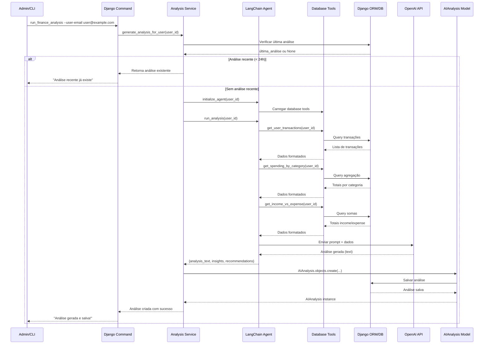

# Agente de IA Financeiro - Documentação Técnica

## Índice

1. [Visão Geral](#visão-geral)
2. [Arquitetura](#arquitetura)
3. [Fluxo de Dados](#fluxo-de-dados)
4. [LangChain Tools](#langchain-tools)
5. [Configuração](#configuração)
6. [Execução](#execução)
7. [Estrutura do Prompt](#estrutura-do-prompt)
8. [Formato de Saída](#formato-de-saída)
9. [Segurança e Isolamento](#segurança-e-isolamento)
10. [Troubleshooting](#troubleshooting)
11. [Expansões Futuras](#expansões-futuras)

---

## Visão Geral

O **Agente de IA Financeiro** é um sistema de análise inteligente que utiliza LangChain 1.0 integrado com a API da OpenAI (modelo `gpt-4o-mini`) para fornecer insights personalizados sobre os hábitos financeiros dos usuários do Finanpy.

### Características Principais

- **Análise Personalizada**: Cada análise é baseada exclusivamente nos dados do usuário específico
- **Insights Acionáveis**: Recomendações práticas que o usuário pode implementar
- **Histórico Persistido**: Todas as análises são armazenadas no banco de dados
- **Isolamento de Dados**: Segurança garantida com filtros por usuário em todas as tools
- **Execução Sob Demanda**: Via Django Command, sem interface web (MVP)

### Objetivos

1. **Educação Financeira**: Ajudar usuários a entender seus padrões de gasto
2. **Motivação**: Fornecer feedback positivo e metas alcançáveis
3. **Ação**: Gerar recomendações específicas e implementáveis
4. **Evolução**: Permitir acompanhamento ao longo do tempo

---

## Arquitetura

### Stack Tecnológica

```
┌─────────────────────────────────────────────┐
│           Django Application                 │
├─────────────────────────────────────────────┤
│                                             │
│  ┌──────────────┐      ┌─────────────────┐│
│  │   AI App     │      │   Core Models   ││
│  │              │      │                 ││
│  │ - Models     │◄─────┤ - User          ││
│  │ - Agents     │      │ - Account       ││
│  │ - Tools      │      │ - Transaction   ││
│  │ - Services   │      │ - Category      ││
│  └──────┬───────┘      └─────────────────┘│
│         │                                  │
│         │ Uses                             │
│         ▼                                  │
│  ┌──────────────────────────────────────┐ │
│  │        LangChain 1.0                 │ │
│  │                                      │ │
│  │  ┌────────────┐   ┌──────────────┐ │ │
│  │  │   Agents   │   │    Tools     │ │ │
│  │  └─────┬──────┘   └──────┬───────┘ │ │
│  │        │                  │         │ │
│  │        └──────────┬───────┘         │ │
│  │                   │                 │ │
│  │                   ▼                 │ │
│  │         ┌──────────────────┐       │ │
│  │         │   AgentExecutor  │       │ │
│  │         └────────┬─────────┘       │ │
│  └──────────────────┼─────────────────┘ │
│                     │                   │
└─────────────────────┼───────────────────┘
                      │
                      ▼
            ┌──────────────────┐
            │   OpenAI API     │
            │  (gpt-4o-mini)   │
            └──────────────────┘
```

### Estrutura de Diretórios

```
ai/
├── __init__.py
├── models.py                          # AIAnalysis model
├── admin.py                           # Django Admin config
├── apps.py                            # App configuration
│
├── agents/
│   ├── __init__.py
│   ├── finance_insight_agent.py      # Agente LangChain principal
│   └── ai_integration_expert.md      # Documento de referência
│
├── tools/
│   ├── __init__.py
│   └── database_tools.py             # LangChain Tools (DB queries)
│
├── services/
│   ├── __init__.py
│   └── analysis_service.py           # Camada de orquestração
│
├── management/
│   └── commands/
│       ├── __init__.py
│       └── run_finance_analysis.py   # Django Command
│
└── migrations/
    └── __init__.py
```

---

## Fluxo de Dados

### Diagrama de Sequência



### Etapas Detalhadas

1. **Inicialização**: Admin executa comando Django
2. **Validação**: Service verifica se usuário existe e se análise recente existe
3. **Coleta de Dados**: Tools consultam banco de dados via Django ORM
4. **Processamento**: Agente LangChain processa dados com LLM (fallback manual é acionado se a resposta estiver incompleta ou ocorrer erro)
5. **Geração**: OpenAI gera texto de análise com insights
6. **Persistência**: Service salva resultado no model AIAnalysis e grava o ID no cache (TTL 24h)
7. **Exibição**: Dashboard exibe última análise ao usuário

---

## LangChain Tools

As tools são funções Python decoradas com `@tool` que o agente LangChain pode chamar para acessar dados do Django.

### 1. `get_user_transactions`

**Propósito**: Retorna transações dos últimos 30 dias do usuário.

**Parâmetros**:
- `user_id` (int): ID do usuário

**Retorno**:
```python
[
    {
        'date': '2025-01-15',
        'description': 'Supermercado',
        'amount': 150.00,
        'type': 'expense',
        'category': 'Alimentação',
        'account': 'Nubank'
    },
    # ... mais transações
]
```

**Implementação**:
```python
from langchain.tools import tool
from datetime import datetime, timedelta
from transactions.models import Transaction

@tool
def get_user_transactions(user_id: int) -> list[dict]:
    """
    Retorna as transações dos últimos 30 dias para o usuário especificado.

    Args:
        user_id: ID do usuário

    Returns:
        Lista de dicionários com dados das transações
    """
    thirty_days_ago = datetime.now() - timedelta(days=30)

    transactions = Transaction.objects.filter(
        account__user_id=user_id,
        transaction_date__gte=thirty_days_ago
    ).select_related('account', 'category').order_by('-transaction_date')

    return [
        {
            'date': t.transaction_date.isoformat(),
            'description': t.description or 'Sem descrição',
            'amount': float(t.amount),
            'type': t.transaction_type,
            'category': t.category.name,
            'account': t.account.name
        }
        for t in transactions
    ]
```

### 2. `get_user_accounts`

**Propósito**: Retorna todas as contas bancárias ativas do usuário.

**Parâmetros**:
- `user_id` (int): ID do usuário

**Retorno**:
```python
[
    {
        'name': 'Conta Corrente',
        'bank': 'Nubank',
        'type': 'checking',
        'balance': 1500.00
    },
    # ... mais contas
]
```

### 3. `get_user_categories`

**Propósito**: Retorna todas as categorias do usuário.

**Parâmetros**:
- `user_id` (int): ID do usuário

**Retorno**:
```python
[
    {'name': 'Alimentação', 'type': 'expense'},
    {'name': 'Salário', 'type': 'income'},
    # ... mais categorias
]
```

### 4. `get_spending_by_category`

**Propósito**: Retorna total gasto por categoria nos últimos 30 dias.

**Parâmetros**:
- `user_id` (int): ID do usuário

**Retorno**:
```python
[
    {'category': 'Alimentação', 'total': 1200.00, 'percentage': 28.5},
    {'category': 'Transporte', 'total': 800.00, 'percentage': 19.0},
    # ... ordenado por total (maior para menor)
]
```

**Implementação**:
```python
from django.db.models import Sum, Q
from decimal import Decimal

@tool
def get_spending_by_category(user_id: int) -> list[dict]:
    """
    Retorna gastos agregados por categoria dos últimos 30 dias.
    """
    thirty_days_ago = datetime.now() - timedelta(days=30)

    # Gastos por categoria
    spending = Transaction.objects.filter(
        account__user_id=user_id,
        transaction_type='expense',
        transaction_date__gte=thirty_days_ago
    ).values('category__name').annotate(
        total=Sum('amount')
    ).order_by('-total')

    # Total de despesas para calcular percentual
    total_expenses = sum(item['total'] for item in spending)

    return [
        {
            'category': item['category__name'],
            'total': float(item['total']),
            'percentage': round((item['total'] / total_expenses * 100), 1) if total_expenses > 0 else 0
        }
        for item in spending
    ]
```

### 5. `get_income_vs_expense`

**Propósito**: Retorna comparativo de receitas vs despesas dos últimos 30 dias.

**Parâmetros**:
- `user_id` (int): ID do usuário

**Retorno**:
```python
{
    'total_income': 5000.00,
    'total_expense': 4200.00,
    'balance': 800.00,
    'savings_rate': 16.0  # percentual economizado
}
```

---

## Configuração

### Variáveis de Ambiente

Adicione as seguintes variáveis ao arquivo `.env`:

```env
# OpenAI API Configuration
OPENAI_API_KEY=sk-proj-xxxxxxxxxxxxxxxxxxxxxxxxxxxxxxxx
AI_MODEL=gpt-4o-mini
AI_MAX_TOKENS=1000
AI_TEMPERATURE=0.7
```

**Descrição das Variáveis**:

- `OPENAI_API_KEY`: API key da OpenAI (obrigatório)
- `AI_MODEL`: Modelo a ser usado (padrão: `gpt-4o-mini`)
- `AI_MAX_TOKENS`: Limite de tokens na resposta (padrão: 1000)
- `AI_TEMPERATURE`: Criatividade do modelo, 0-1 (padrão: 0.7)

### Django Settings

No arquivo `core/settings.py`, adicione:

```python
from decouple import config

# AI Configuration
OPENAI_API_KEY = config('OPENAI_API_KEY', default='')
AI_MODEL = config('AI_MODEL', default='gpt-4o-mini')
AI_MAX_TOKENS = config('AI_MAX_TOKENS', default=1000, cast=int)
AI_TEMPERATURE = config('AI_TEMPERATURE', default=0.7, cast=float)
```

### Requirements.txt

Certifique-se de ter as seguintes dependências:

```
langchain==0.3.28
langchain-openai==0.3.0
langchain-community==0.3.28
openai==1.59.5
```

Instale com:
```bash
pip install -r requirements.txt
```

---

## Execução

### Django Command

A análise é executada via Django Command personalizado.

#### Sintaxe

```bash
# Analisar usuário específico
python manage.py run_finance_analysis --user-email user@example.com

# Analisar todos os usuários
python manage.py run_finance_analysis --all
```

#### Argumentos

- `--user-email <email>`: Email do usuário para análise individual
- `--all`: Flag para processar todos os usuários ativos
- `--force`: (Futuro) Forçar geração mesmo se análise recente existir

#### Exemplos

```bash
# Exemplo 1: Análise individual
python manage.py run_finance_analysis --user-email joao@email.com

# Exemplo 2: Todos os usuários
python manage.py run_finance_analysis --all

# Exemplo 3: Com virtualenv ativado
source .venv/bin/activate
python manage.py run_finance_analysis --user-email maria@email.com
```

#### Output Esperado

```
Generating financial analysis for user: joao@email.com
[IA] Initializing LangChain agent...
[IA] Loading database tools...
[IA] Fetching user financial data...
[IA] Calling OpenAI API (gpt-4o-mini)...
[IA] Analysis generated successfully!
[DB] Saving analysis to database...
✓ Analysis completed and saved for user joao@email.com
  Analysis ID: 42
  Period: Últimos 30 dias
  Insights: 4
  Recommendations: 5
  Tokens (in/out): 612 / 489
  Latency: 2800 ms
```

### Limitações

- **Rate Limiting**: 1 análise por usuário a cada 24 horas
- **Dados Mínimos**: Usuário deve ter pelo menos 5 transações
- **Timeout**: Análise tem timeout de 60 segundos
- **Custo**: Cada análise consome ~500-1000 tokens da OpenAI

### Métricas Registradas
- `elapsed_ms`: tempo total do serviço (inclui cache, agent e persistência).
- `input_tokens`, `output_tokens`, `total_tokens`: métricas retornadas pelo modelo via LangChain.
- `source`: identifica se a análise veio do agente, fallback, cache ou reutilização recente.
- `reason`: texto explicando motivo do fallback quando aplicável.
- As informações são logadas com prefixo `ai.analysis.*` e exibidas pelo comando para facilitar observabilidade.

---

## Estrutura do Prompt

### System Prompt

O agente utiliza um prompt de sistema detalhado que define seu comportamento:

```python
SYSTEM_PROMPT = """
Você é um assistente financeiro pessoal especializado em análise de gastos pessoais.

Seu objetivo é analisar os dados financeiros do usuário e fornecer uma análise
clara, objetiva e motivadora em português do Brasil.

## Sua Análise Deve Conter:

1. **Visão Geral** (2-3 frases)
   - Resumo do período analisado
   - Saldo positivo ou negativo
   - Principais destaques

2. **Insights Principais** (3-5 itens)
   - Padrões de gasto identificados
   - Categorias com maior impacto
   - Comparações e porcentagens
   - Tendências positivas ou preocupantes

3. **Recomendações Práticas** (3-5 itens)
   - Ações específicas e implementáveis
   - Metas realistas
   - Sugestões de economia
   - Próximos passos

## Diretrizes de Estilo:

- Use linguagem amigável e motivadora
- Evite julgamentos negativos
- Foque em oportunidades de melhoria
- Use emojis para tornar leitura agradável
- Seja específico com números e porcentagens
- Forneça contexto (ex: "28% do total")

## Formato de Saída:

Use markdown simples com seções claras:
- 📊 para Visão Geral
- 🔍 para Insights
- 💡 para Recomendações
- 🎯 para Metas

Seja conciso mas informativo. Máximo 500 palavras.
"""
```

### User Prompt

O prompt do usuário é gerado dinamicamente com base nos dados coletados:

```python
user_prompt = f"""
Analise os dados financeiros do usuário abaixo e forneça uma análise completa:

Período: Últimos 30 dias

Total de Transações: {transaction_count}
Receitas: R$ {total_income}
Despesas: R$ {total_expense}
Saldo: R$ {balance}

Contas:
{accounts_summary}

Gastos por Categoria:
{spending_by_category}

Forneça uma análise personalizada e acionável.
"""
```

---

## Formato de Saída

### Estrutura da Análise

A análise gerada segue um formato padronizado:

```
Olá! Analisando suas finanças dos últimos 30 dias, aqui está o panorama:

📊 Visão Geral:
- Você teve um saldo positivo de R$ 800,00 neste mês, parabéns!
- Suas despesas representaram 84% da sua receita total.
- Total de 45 transações registradas.

🔍 Insights Principais:
1. **Alimentação é seu maior gasto** - R$ 1.200,00 (28,5% do total)
   Isso inclui supermercado, restaurantes e delivery.

2. **Transporte está elevado** - R$ 800,00 (19% do total)
   Considere avaliar alternativas mais econômicas.

3. **Gastos com lazer equilibrados** - R$ 600,00 (14,3%)
   Você está mantendo um bom balanço entre economia e qualidade de vida.

4. **Receitas estáveis** - R$ 5.000,00
   Sua renda tem se mantido consistente, o que é positivo.

💡 Recomendações:
1. **Reduza gastos com alimentação em 10%** (economize R$ 120/mês)
   - Prepare mais refeições em casa
   - Planeje compras de supermercado com lista
   - Reduza pedidos de delivery para 1x por semana

2. **Otimize transporte**
   - Avalie passar para transporte público alguns dias
   - Use aplicativos de carona compartilhada
   - Considere bike para distâncias curtas

3. **Crie fundo de emergência**
   - Com economia de R$ 120, comece reservando 50% (R$ 60)
   - Meta: 3 meses de despesas (R$ 12.600) em 12 meses

4. **Monitore gastos variáveis**
   - Categorias como lazer e compras podem ser ajustadas
   - Use o Finanpy para acompanhar diariamente

5. **Comemore suas conquistas**
   - Saldo positivo é uma vitória!
   - Continue registrando transações

🎯 Meta Sugerida para Próximo Mês:
Reduza alimentação para R$ 1.080 (10% menos)
→ Isso elevará sua taxa de poupança de 16% para 18,4%
→ Você economizará R$ 1.104 a mais por ano!

Continue assim! 💪
```

### Campos Salvos no Banco

```python
AIAnalysis.objects.create(
    user=user,
    analysis_text=analysis_text,  # Texto completo acima
    key_insights=[
        'Alimentação é seu maior gasto (28,5%)',
        'Transporte está elevado (R$ 800)',
        'Receitas estáveis (R$ 5.000)',
        'Saldo positivo (R$ 800)'
    ],
    recommendations=[
        'Reduza gastos com alimentação em 10%',
        'Otimize transporte',
        'Crie fundo de emergência',
        'Monitore gastos variáveis',
        'Comemore suas conquistas'
    ],
    period_analyzed='Últimos 30 dias'
)
```

---

## Segurança e Isolamento

### Princípios de Segurança

1. **Isolamento por Usuário**: Todas as tools filtram por `user_id`
2. **API Key Segura**: Armazenada em variável de ambiente, nunca em código
3. **Rate Limiting**: Máximo 1 análise por usuário a cada 24h
4. **Validação de Entrada**: User ID sempre validado antes de processamento
5. **Logs Sanitizados**: Logs não expõem dados financeiros sensíveis

### Implementação de Isolamento

```python
# ✓ CORRETO - Filtra por user
def get_user_transactions(user_id: int):
    return Transaction.objects.filter(
        account__user_id=user_id  # Isolamento garantido
    )

# ✗ INCORRETO - Expõe dados de todos
def get_all_transactions():  # NUNCA FAZER ISSO
    return Transaction.objects.all()
```

### Validação de User ID

```python
def generate_analysis_for_user(user_id: int):
    # 1. Validar que usuário existe
    try:
        user = get_user_model().objects.get(id=user_id)
    except User.DoesNotExist:
        raise ValueError(f'User {user_id} not found')

    # 2. Verificar análise recente (rate limiting)
    last_analysis = AIAnalysis.objects.filter(
        user=user,
        created_at__gte=timezone.now() - timedelta(hours=24)
    ).first()

    if last_analysis:
        raise ValueError('Analysis generated less than 24h ago')

    # 3. Prosseguir com análise...
```

### Logs Seguros

```python
import logging

logger = logging.getLogger(__name__)

# ✓ CORRETO - Não expõe dados sensíveis
logger.info(f'Generating analysis for user_id={user_id}')
logger.info(f'Analysis completed in {elapsed_time}s')

# ✗ INCORRETO - Expõe dados financeiros
logger.info(f'User {email} has balance {balance}')  # NUNCA
logger.debug(f'Transactions: {transactions}')  # NUNCA
```

---

## Política de Privacidade e Compliance

### Privacidade (LGPD)
- A análise é executada somente mediante dados do próprio usuário autenticado.
- Usuários podem solicitar exclusão das análises via remoção das entradas `AIAnalysis`.
- Nenhum dado financeiro é enviado para logs ou exposto em prompts além do necessário.
- A IA não reutiliza dados de outros usuários e não armazena contexto entre execuções.

### Disclaimer para Usuário Final
- O dashboard exibe aviso informando que a análise é automatizada e deve ser validada manualmente.
- Recomenda-se divulgar termos adicionais no onboarding sobre uso de IA e compartilhamento com OpenAI.

### Testes de Conformidade
- Casos de teste garantem isolamento (ver `ai/tests.py`).
- Rate limit de 24h evita processamento excessivo de dados.
- Em caso de erro da IA, fallback gera análise baseada apenas em dados locais.

---

## Troubleshooting

### Problemas Comuns

#### 1. Erro: "OpenAI API key not configured"

**Causa**: Variável `OPENAI_API_KEY` não configurada.

**Solução**:
```bash
# Adicione ao .env
OPENAI_API_KEY=sk-proj-xxxxxxxxxxxx

# Ou exporte temporariamente
export OPENAI_API_KEY=sk-proj-xxxxxxxxxxxx
```

#### 2. Erro: "User has no transactions"

**Causa**: Usuário não possui transações suficientes para análise.

**Solução**:
- Criar pelo menos 5 transações para o usuário
- Ou ajustar lógica para lidar com usuários novos

#### 3. Erro: "Rate limit exceeded (429)"

**Causa**: Muitas requisições à API OpenAI.

**Solução**:
- Aguardar 1 minuto e tentar novamente
- Verificar cota da conta OpenAI
- Implementar retry com backoff exponencial

#### 4. Análise muito genérica

**Causa**: Dados insuficientes ou prompt impreciso.

**Solução**:
- Adicionar mais transações de teste
- Refinar prompt do agente
- Aumentar `AI_MAX_TOKENS` para respostas mais detalhadas

#### 5. Timeout ao gerar análise

**Causa**: OpenAI API demorou muito.

**Solução**:
```python
# Aumentar timeout no AgentExecutor
agent_executor = AgentExecutor(
    agent=agent,
    tools=tools,
    max_execution_time=60  # 60 segundos
)
```

### Debugging

#### Habilitar Logs Detalhados

```python
import logging

logging.basicConfig(level=logging.DEBUG)
logger = logging.getLogger('langchain')
logger.setLevel(logging.DEBUG)
```

#### Testar Tools Individualmente

```python
python manage.py shell

from ai.tools.database_tools import get_user_transactions

# Testar com user_id existente
result = get_user_transactions(user_id=1)
print(result)
```

#### Verificar Análise no Admin

1. Acesse Django Admin: `http://localhost:8000/admin/`
2. Navegue para **AI / AI Analyses**
3. Verifique análises criadas e seus campos

---

## Expansões Futuras

### Roadmap Pós-MVP

#### Sprint 9: Interface Web para Gerar Análise
- Adicionar botão "Gerar Nova Análise" no dashboard
- Criar view Django para processar requisição
- Adicionar feedback em tempo real (loading state)
- Implementar polling ou WebSocket para status

#### Sprint 10: Análises Agendadas
- Configurar Celery para tarefas assíncronas
- Criar task Celery para gerar análises automaticamente
- Agendar análises semanais/mensais via Celery Beat
- Enviar email quando análise estiver pronta

#### Sprint 11: Chat Interativo com Agente
- Implementar chat interface no dashboard
- Permitir perguntas específicas ao agente
- Manter contexto de conversa
- Integrar histórico de análises

#### Sprint 12: Alertas Inteligentes
- Detectar gastos anormais automaticamente
- Alertar quando meta é atingida
- Notificar quando categoria ultrapassa limite
- Enviar dicas proativas

#### Sprint 13: Previsões Financeiras
- Usar histórico para prever gastos futuros
- Projetar economia a longo prazo
- Sugerir metas baseadas em tendências
- Gráficos de projeção

#### Sprint 14: Integração Open Banking
- Conectar com APIs de bancos reais
- Importar transações automaticamente
- Análise baseada em dados em tempo real
- Sincronização automática

### Melhorias Técnicas

- **Cache de Análises**: Implementar cache Redis para análises recentes
- **Múltiplos Modelos**: Suportar GPT-4, Claude, etc.
- **Fine-tuning**: Treinar modelo específico para finanças pessoais
- **A/B Testing**: Testar diferentes prompts para melhor qualidade
- **Métricas de Qualidade**: Coletar feedback dos usuários sobre análises
- **Multilíngue**: Suporte para inglês, espanhol, etc.

---

## Referências

- [LangChain Documentation](https://python.langchain.com/)
- [OpenAI API Reference](https://platform.openai.com/docs/api-reference)
- [Django Custom Management Commands](https://docs.djangoproject.com/en/5.0/howto/custom-management-commands/)
- [Django ORM Optimization](https://docs.djangoproject.com/en/5.0/topics/db/optimization/)

---

## Suporte

Para questões técnicas:
1. Consulte este documento
2. Verifique logs do Django
3. Teste tools individualmente no shell
4. Revise configuração de variáveis de ambiente
5. Consulte a pasta `ai/agents/ai_integration_expert.md` para padrões de desenvolvimento

---

**Versão**: 1.0
**Data**: Janeiro 2025
**Autor**: Equipe Finanpy
**Stack**: Python 3.13+ | Django 5+ | LangChain 1.0 | OpenAI API
