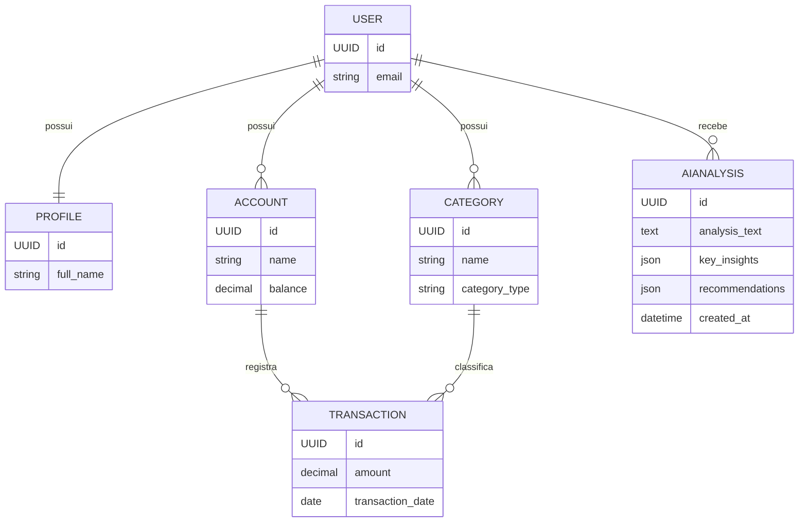

# Modelos de Dados

Este documento descreve a estrutura dos models Django e os relacionamentos entre as entidades do Finanpy.

## Diagrama de Relacionamentos

```
User (Django Auth)
  ↓ OneToOne
Profile

User
  ↓ OneToMany
Account
  ↓ OneToMany
Transaction
  ↓ ManyToOne
Category
  ↓ ManyToOne
User

User
  ↓ OneToMany
AIAnalysis
```



## Models

### User
Utiliza o model padrão do Django (`django.contrib.auth.models.User`).

**Campos principais**:
- `email`: Email do usuário (usado como username)
- `password`: Senha hasheada
- `is_active`: Status da conta
- `date_joined`: Data de cadastro
- `last_login`: Último acesso

**Relacionamentos**:
- OneToOne com `Profile`
- OneToMany com `Account`
- OneToMany com `Category`

---

### Profile
Informações complementares do usuário.

**App**: `profiles`

**Campos**:

| Campo       | Tipo            | Descrição                           | Obrigatório |
|-------------|-----------------|-------------------------------------|-------------|
| user        | OneToOneField   | Relação com User                    | Sim         |
| full_name   | CharField       | Nome completo do usuário            | Sim         |
| phone       | CharField       | Telefone de contato                 | Não         |
| created_at  | DateTimeField   | Data de criação                     | Auto        |
| updated_at  | DateTimeField   | Data de última atualização          | Auto        |

**Constraints**:
- `user`: unique, on_delete=CASCADE

**Comportamento**:
- Criado automaticamente ao criar usuário (signal)
- Deletado automaticamente ao deletar usuário (CASCADE)

**Exemplo**:
```python
class Profile(models.Model):
    user = models.OneToOneField(User, on_delete=models.CASCADE)
    full_name = models.CharField(max_length=200)
    phone = models.CharField(max_length=20, blank=True)
    created_at = models.DateTimeField(auto_now_add=True)
    updated_at = models.DateTimeField(auto_now=True)

    def __str__(self):
        return self.full_name
```

---

### Account
Contas bancárias do usuário.

**App**: `accounts`

**Campos**:

| Campo        | Tipo            | Descrição                          | Obrigatório |
|--------------|-----------------|-------------------------------------|-------------|
| user         | ForeignKey      | Relação com User                    | Sim         |
| name         | CharField       | Nome/apelido da conta               | Sim         |
| bank_name    | CharField       | Nome do banco                       | Sim         |
| account_type | CharField       | Tipo de conta (corrente, poupança)  | Sim         |
| balance      | DecimalField    | Saldo atual                         | Sim         |
| is_active    | BooleanField    | Status da conta                     | Sim         |
| created_at   | DateTimeField   | Data de criação                     | Auto        |
| updated_at   | DateTimeField   | Data de última atualização          | Auto        |

**Constraints**:
- `user`: on_delete=CASCADE
- `balance`: max_digits=10, decimal_places=2, default=0
- `is_active`: default=True

**Choices para account_type**:
```python
ACCOUNT_TYPES = [
    ('checking', 'Conta Corrente'),
    ('savings', 'Conta Poupança'),
    ('investment', 'Conta Investimento'),
]
```

**Comportamento**:
- Sempre filtrado por usuário logado
- Saldo calculado pela soma das transações
- Deletado automaticamente ao deletar usuário (CASCADE)

**Exemplo**:
```python
class Account(models.Model):
    ACCOUNT_TYPES = [
        ('checking', 'Conta Corrente'),
        ('savings', 'Conta Poupança'),
        ('investment', 'Conta Investimento'),
    ]

    user = models.ForeignKey(User, on_delete=models.CASCADE)
    name = models.CharField(max_length=100)
    bank_name = models.CharField(max_length=100)
    account_type = models.CharField(max_length=50, choices=ACCOUNT_TYPES)
    balance = models.DecimalField(max_digits=10, decimal_places=2, default=0)
    is_active = models.BooleanField(default=True)
    created_at = models.DateTimeField(auto_now_add=True)
    updated_at = models.DateTimeField(auto_now=True)

    def __str__(self):
        return f'{self.name} - {self.bank_name}'
```

---

### Category
Categorias para organização de transações.

**App**: `categories`

**Campos**:

| Campo         | Tipo           | Descrição                           | Obrigatório |
|---------------|----------------|-------------------------------------|-------------|
| user          | ForeignKey     | Relação com User                    | Sim         |
| name          | CharField      | Nome da categoria                   | Sim         |
| category_type | CharField      | Tipo (entrada ou saída)             | Sim         |
| color         | CharField      | Cor hexadecimal para UI             | Não         |
| created_at    | DateTimeField  | Data de criação                     | Auto        |
| updated_at    | DateTimeField  | Data de última atualização          | Auto        |

**Constraints**:
- `user`: on_delete=CASCADE
- `category_type`: choices entre 'income' e 'expense'

**Choices para category_type**:
```python
CATEGORY_TYPES = [
    ('income', 'Entrada'),
    ('expense', 'Saída'),
]
```

**Comportamento**:
- Sempre filtrada por usuário logado
- Cor padrão se não informada
- Deletado automaticamente ao deletar usuário (CASCADE)

**Exemplo**:
```python
class Category(models.Model):
    CATEGORY_TYPES = [
        ('income', 'Entrada'),
        ('expense', 'Saída'),
    ]

    user = models.ForeignKey(User, on_delete=models.CASCADE)
    name = models.CharField(max_length=100)
    category_type = models.CharField(max_length=10, choices=CATEGORY_TYPES)
    color = models.CharField(max_length=7, blank=True, default='#667eea')
    created_at = models.DateTimeField(auto_now_add=True)
    updated_at = models.DateTimeField(auto_now=True)

    class Meta:
        verbose_name_plural = 'Categories'

    def __str__(self):
        return self.name
```

---

### Transaction
Transações financeiras (entradas e saídas).

**App**: `transactions`

**Campos**:

| Campo            | Tipo           | Descrição                           | Obrigatório |
|------------------|----------------|-------------------------------------|-------------|
| account          | ForeignKey     | Conta associada                     | Sim         |
| category         | ForeignKey     | Categoria da transação              | Sim         |
| transaction_type | CharField      | Tipo (entrada ou saída)             | Sim         |
| amount           | DecimalField   | Valor da transação                  | Sim         |
| transaction_date | DateField      | Data da transação                   | Sim         |
| description      | TextField      | Descrição/observação                | Não         |
| created_at       | DateTimeField  | Data de criação                     | Auto        |
| updated_at       | DateTimeField  | Data de última atualização          | Auto        |

**Constraints**:
- `account`: on_delete=CASCADE
- `category`: on_delete=PROTECT
- `amount`: max_digits=10, decimal_places=2
- `transaction_type`: choices entre 'income' e 'expense'

**Choices para transaction_type**:
```python
TRANSACTION_TYPES = [
    ('income', 'Entrada'),
    ('expense', 'Saída'),
]
```

**Comportamento**:
- Sempre acessível apenas pelo dono da conta
- Atualiza saldo da conta automaticamente (via signal)
- Validação: tipo deve corresponder ao tipo da categoria
- Ordenação padrão: mais recentes primeiro

**Exemplo**:
```python
class Transaction(models.Model):
    TRANSACTION_TYPES = [
        ('income', 'Entrada'),
        ('expense', 'Saída'),
    ]

    account = models.ForeignKey(Account, on_delete=models.CASCADE)
    category = models.ForeignKey(Category, on_delete=models.PROTECT)
    transaction_type = models.CharField(max_length=10, choices=TRANSACTION_TYPES)
    amount = models.DecimalField(max_digits=10, decimal_places=2)
    transaction_date = models.DateField()
    description = models.TextField(blank=True)
    created_at = models.DateTimeField(auto_now_add=True)
    updated_at = models.DateTimeField(auto_now=True)

    class Meta:
        ordering = ['-transaction_date', '-created_at']

    def __str__(self):
        return f'{self.transaction_type} - R$ {self.amount} - {self.transaction_date}'
```

---

## Relacionamentos Detalhados

### User → Profile (OneToOne)
- Um usuário tem exatamente um perfil
- Perfil é criado automaticamente via signal
- Deletar usuário deleta o perfil (CASCADE)

### User → Account (OneToMany)
- Um usuário pode ter várias contas
- Uma conta pertence a um único usuário
- Deletar usuário deleta todas as contas (CASCADE)

### User → Category (OneToMany)
- Um usuário pode ter várias categorias
- Uma categoria pertence a um único usuário
- Deletar usuário deleta todas as categorias (CASCADE)

### Account → Transaction (OneToMany)
- Uma conta pode ter várias transações
- Uma transação pertence a uma única conta
- Deletar conta deleta todas as transações (CASCADE)

### Category → Transaction (OneToMany)
- Uma categoria pode ter várias transações
- Uma transação pertence a uma única categoria
- Deletar categoria é PROTEGIDO (PROTECT) - impede se houver transações

---

## Regras de Negócio

### Isolamento de Dados
**Todos os dados são isolados por usuário**:
```python
# Correto
accounts = Account.objects.filter(user=request.user)

# Incorreto - expõe dados de outros usuários
accounts = Account.objects.all()
```

### Validações

#### Account
- `balance` deve ser decimal com 2 casas
- `name` não pode ser vazio
- `bank_name` não pode ser vazio
- Usuário não pode ver/editar contas de outros usuários

#### Category
- `name` não pode ser vazio
- `category_type` deve ser 'income' ou 'expense'
- Cor deve ser hexadecimal válido (se fornecida)
- Usuário não pode ver/editar categorias de outros usuários

#### Transaction
- `amount` deve ser positivo
- `transaction_type` deve corresponder ao `category.category_type`
- `account` deve pertencer ao usuário logado
- `category` deve pertencer ao usuário logado
- `transaction_date` não pode ser futura (recomendado)

### Cálculos

#### Saldo da Conta
```python
def calculate_balance(account):
    incomes = account.transaction_set.filter(
        transaction_type='income'
    ).aggregate(total=Sum('amount'))['total'] or 0

    expenses = account.transaction_set.filter(
        transaction_type='expense'
    ).aggregate(total=Sum('amount'))['total'] or 0

    return incomes - expenses
```

#### Saldo Total do Usuário
```python
def total_balance(user):
    accounts = Account.objects.filter(user=user, is_active=True)
    return sum(account.balance for account in accounts)
```

---

## Campos Obrigatórios

**Todos os models devem ter**:
```python
created_at = models.DateTimeField(auto_now_add=True)
updated_at = models.DateTimeField(auto_now=True)
```

**Motivos**:
- Auditoria
- Ordenação cronológica
- Debugging
- Análises temporais

---

## Meta Classes Recomendadas

```python
class Meta:
    verbose_name = 'Nome Singular'
    verbose_name_plural = 'Nome Plural'
    ordering = ['-created_at']  # Ou outro campo relevante
    indexes = [
        models.Index(fields=['user', '-created_at']),
    ]
```

---

## Queries Otimizadas

### Select Related (ForeignKey)
```python
# Evita N+1 queries
transactions = Transaction.objects.select_related(
    'account', 'category'
).filter(account__user=request.user)
```

### Prefetch Related (Reverse ForeignKey)
```python
# Carrega transações com contas
accounts = Account.objects.prefetch_related(
    'transaction_set'
).filter(user=request.user)
```

### Aggregations
```python
from django.db.models import Sum, Count

# Total de entradas do mês
incomes = Transaction.objects.filter(
    account__user=request.user,
    transaction_type='income',
    transaction_date__month=current_month
).aggregate(total=Sum('amount'))
```

---

## Signals

### Criação Automática de Profile
```python
from django.db.models.signals import post_save
from django.dispatch import receiver

@receiver(post_save, sender=User)
def create_user_profile(sender, instance, created, **kwargs):
    if created:
        Profile.objects.create(user=instance)
```

### Atualização de Saldo (Opcional)
```python
@receiver(post_save, sender=Transaction)
def update_account_balance(sender, instance, **kwargs):
    account = instance.account
    account.balance = calculate_balance(account)
    account.save()
```

---

### AIAnalysis
Análises financeiras geradas pelo agente de IA.

**App**: `ai`

**Campos**:

| Campo             | Tipo           | Descrição                                      | Obrigatório |
|-------------------|----------------|------------------------------------------------|-------------|
| user              | ForeignKey     | Usuário dono da análise                        | Sim         |
| analysis_text     | TextField      | Texto completo gerado pela IA                  | Sim         |
| key_insights      | JSONField      | Lista de insights principais                   | Sim (default lista) |
| recommendations   | JSONField      | Lista de recomendações acionáveis              | Sim (default lista) |
| period_analyzed   | CharField      | Janela temporal analisada                      | Sim         |
| created_at        | DateTimeField  | Data/hora da criação                           | Auto        |
| updated_at        | DateTimeField  | Última atualização                              | Auto        |

**Constraints**:
- Índice composto `(user, created_at)` para recuperar rapidamente a última análise.
- Ordenação padrão descendente por `created_at`.

**Comportamento**:
- Rate limit de 24h controlado em `analysis_service.generate_analysis_for_user`.
- Resultados podem ser lidos do cache (`django.core.cache`) antes de nova geração.
- Exibido no dashboard via parcial `includes/ai_analysis_card.html`.

**Exemplo**:
```python
class AIAnalysis(models.Model):
    user = models.ForeignKey(settings.AUTH_USER_MODEL, on_delete=models.CASCADE)
    analysis_text = models.TextField()
    key_insights = models.JSONField(default=list)
    recommendations = models.JSONField(default=list)
    period_analyzed = models.CharField(max_length=100)
    created_at = models.DateTimeField(auto_now_add=True)
    updated_at = models.DateTimeField(auto_now=True)

    class Meta:
        ordering = ['-created_at']
        indexes = [models.Index(fields=['user', '-created_at'])]

    def __str__(self):
        return f'{self.user.email} - {self.created_at:%d/%m/%Y %H:%M}'
```

---

## Migrations

### Criando Migrations
```bash
python manage.py makemigrations
```

### Aplicando Migrations
```bash
python manage.py migrate
```

### Verificando Status
```bash
python manage.py showmigrations
```

---

## Boas Práticas

1. **Sempre use `get_object_or_404`** para buscar objetos únicos
2. **Sempre filtre por usuário** para garantir segurança
3. **Use `select_related` e `prefetch_related`** para otimizar queries
4. **Valide tipos de transação** com categorias
5. **Use transactions do Django** para operações críticas
6. **Mantenha `created_at` e `updated_at`** em todos os models
7. **Use `__str__`** descritivos para facilitar debug
8. **Defina `Meta.ordering`** para ordenação consistente
9. **Use `choices`** para campos com valores fixos
10. **Proteja deleções** com `on_delete=PROTECT` quando necessário
